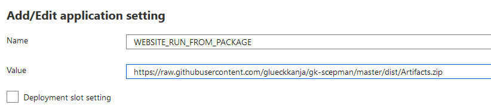

> This is an alternative approach to Azure Marketplace Deployment

## SCEPman Delpoyment via GitHub (optional)

This article will show you how you can deploy SCEPman via GitHub. But why should you do this? If your are a tech enthusiast with the ability to self-support and you want to note topics and issues (without guarantee for an answer or a direct troubleshooting or fixing) the GitHub deployment is just right for you.

## Start the Deployment

> You need your Client ID and your Client Secret before you can start the deployment

Instead of using Azure Marketplace you can deploy SCEPman via Github. Click the following deploy button to start the deployment via GitHub:

<a href="https://portal.azure.com/#create/Microsoft.Template/uri/https%3A%2F%2Fraw.githubusercontent.com%2Fglueckkanja%2Fgk-scepman%2Fmaster%2Fazuredeploy.json" target="_blank">
    
</a>

Next, you will see the following configuration menu:

[](./media/scepman_optional1.png)

1. Select an existing resource group or create a new one (SCEPman resources will be deployed in this group)
2. Set the location according to your location
3. Enter your **App Registration Guid** (App client ID)
4. Enter your **App Registration Key** (Client secret)
5. Define a **Key Vault Name**, **App Service Plan Name** and web site
6. Then, click **I agree to the terms...**
7. Finally, click **Purchase**

When you did it you need to create a custom domain (link zum Artikel einbauen)

To get continuous updates for SCEPman you can point a configuration variable to the [maintained GitHub repository](https://github.com/glueckkanja/gk-scepman) of SCEPman. During every restart the Azure Web App will do a check and a copy deployment if necessary. To configure this do the following:

1. Go to your Azure AD
2. Navigate to **App Service**
3. Choose your SCEPman app
4. Then, click **Configuration** (submenu **Setting**)
5. Look for **WEBSITE_RUN_FROM_PACKAGE** and click on it
   [](./media/scepman_optional2.png)
6. Then replace the URL with the SCEPman GitHub URL:  
   ```https://github.com/glueckkanja/gk-scepman/raw/master/dist/Artifacts.zip```  
   [](./media/scepman_optional3.png)
