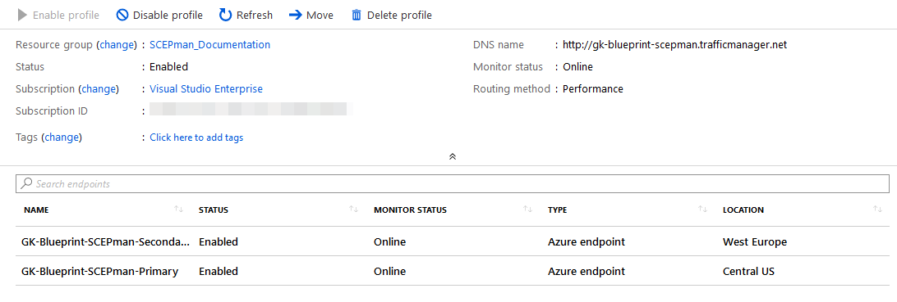

# High Availability Scenario


SCEPman Enterprise Edition only


## Load Balancer Deployment \(optional\)

This section describes a high availability architecture for production use.

## Clone App

After successful deployment of SCEPman, you can set up a load balancer for higher availability. Start cloning the app:

| Task | Image |
| :--- | :--- |
| 1. Navigate to **App Service** |  |
| 2. Scroll down to **Development Tools** and click **Clone App** |  |
| 3. Fill in the required fields |  |
| 4. Click **App Service plan/Location** |  |
| 5. Then, click **Create new** to create a new service plan |  |
| 6. Enter a **App Service plan** and select a **Location** and a **Pricing tier** |  |
| 7. Click **OK** |  |
| 8. Do not configure the **Clone Settings** |  |
| 9. Finally, click **Create** |  |

Next, you need a managed identity for the cloned app:

| Task | Image |
| :--- | :--- |
| 1. Go to your cloned web app and click **Identity** |  |
| 2. Under **System assigned** switch the Status to **On** |  |
| 3. Click **Save** |  |
| 4. This will register your web app into Azure AD |  |

Your **Identity** should look like this:

## Setup Azure Key Vault Access Policy

| Task | Image |
| :--- | :--- |
| 1. Go to your Key Vault |  |
| 2. Click **Access policies** and then click **Add new** |  |
| 3. In the submenu **Add access policy** click **Select principal** |  |
| 4. Search your web app identity |  |
| 5. Now select **Key permissions**, **Secret permissions** and **Certificate permissions**. |  |
| 6. Your access policy should look like this |  |
| 7. Then click **Add** |  |
| 8. Finally, click **Save** |  |

## Setup Traffic Manager

| Task | Image |
| :--- | :--- |
| 1. In Microsoft Azure click **Create a resource** |  |
| 2. Search **Traffic Manager profile** and click **Create** |  |
| 3. Fill in the fields |  |
| 4. Then, click **Create** |  |
| 3. After your Traffic Manager is deployed, go to it and click **Configuration** |  |
| 4. Change the settings |  |
| 5. Then, under **Settings**, choose **Endpoints** |  |
| 6. Click **Add** and choose the primary web app |  |
| 7. Repeat these steps for your second web app |  |

In the **Overview** your traffic manager should like this \(here you find the traffic manage URL\):

## Own Application Setup \(optional\)

The SCEPman application will be loaded from the zip file which is located in a Glück & Kanja [Github repository](https://github.com/glueckkanja/gk-scepman/raw/master/dist/Artifacts.zip). This zip file will be updated automatically from the Glück & Kanja development team. If a customer does not want to get auto-updates, the web apps can load the zip file from the self-managed storage account.

| Task | Image |  |
| :--- | :--- | :--- |
| 1. In Microsoft Azure click \*\*Create a resource |  |  |
| 2. Search for **Storage account** and click **Create** |  |  |
| 3. Configure your storage account like this |  |  |
| 4. Click **Create** |  |  |
| 5. Go to your Storage account and choose **Blobs** |  |  |
| 6. Then, click **+ Container** |  |  |
| 7. Enter a **Name** |  |  |
| 8. As **Public access level** select **Blob \(anonymous read access for blobs only\)** |  |  |
| 9. Click **OK** |  |  |
| 10. Select your Container and click **Upload** |  |  |
| 11. Choose the **Artifacts.zip** |  |  |
| 12. Then, click **Upload** |  |  |
| 13. Next, click on the zip-file |  |  |
| 14. Click **Properties** and copy the **Uri** value |  |  |
| 15. Then, navigate to your primary web app in \*\*App Services |  |  |
| 16. Click **Configuration** |  |  |
| 17. In **Application settings** search **WEBSITE\_RUN\_FROM\_PACKAGE** |  |  |
| 18. Repeat the steps 14 to 17 for each web app and restart these web apps after your changes |  |  |

