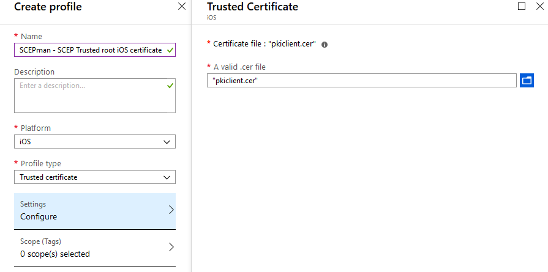
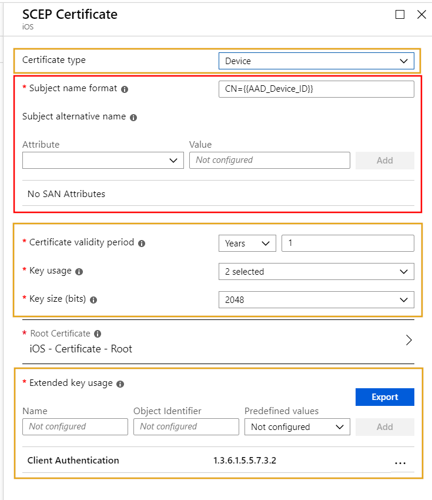

## iOS Enterprise Certificate Deployment

iOS certificate deployment is very similar to Windows 10, macOS and Android Enterprise deployments.

First, we need to trust the public root certificate from SCEPman. Therefore, you have to download the CA certificate (from SCEPman) and deploy it via a trusted certificate profile in Microsoft Intune:

Download the CA certificate:

Then, create a profile in Microsoft Intune:

1. Download the CA Certificate
2. Then, create a profile in Microsoft Intune
3. Select **iOS** as **Platform**
4. Select **Trusted Certificate** as **Profile type**
5. Click **Settings**, select **A valid .cer file**
6. Then, click **OK**
7. Finally, click **Create**

When you are done with it you can deploy this profile to your devices.

Now, you have to create a SCEP certificate profile to deploy the device certificates. Important for this step is the SCEP Server URL. This URL can be found in the **Overview** submenu of the app service of SCEPman:

Append the following to your URL: **/certsrv/mscep/mscep.dll**. Note this URL: https://scepman-xxx.azurewebsites.net/certsrv/mscep/mscep.dll

Next, to finally deploy the device certificates you have to create a SCEP certificate profile in Intune:

1. Navigate to **Microsoft Intune**
2. Click **Device Configuration**
3. Choose **Profile** and click **Create profile**
4. Then, enter a **Name**
5. Select **iOS** as **Platform**
6. Select **SCEP Certificate** as **Profile type**
7. Click **Settings**

8. Configure the **SCEP Certificate**

> [!IMPORTANT]
> You can not configure all **SCEP Certificate** settings. This is because some settings are mandatory set by SCEPman, the yellow rectangle is automatically set by SCEPman (for better visibility I recommend to set the settings in the yellow rectangle to the SCEPman mandatory settings like shown below). Hereby is the Key usage set to **Digital signature** and **Key encipherment**. The validity period is set to fixed 6 month currently. The red rectangle are settings which are free to modify. Long term all settings will be supported for configuration. **There is a dependency on the {{AAD_Device_ID}} in the subject name, which is used as a seed for the certificate serial number generation. Therefore the subject name must include {{AAD_Device_ID}}**.
>
> 

9. Scroll down and enter the URL you have noted
10. Then, click **Add**
11. Next click **OK** and finally click **Create**

When all its done, you have the following two certificate configurations:

* SCEPman - SCEP iOS device certificate
* SCEPman - Trusted root iOS certificate

## Check the Certificate on your Device

## Next Step

* [Troubleshooting](11_troubleshooting.md)
