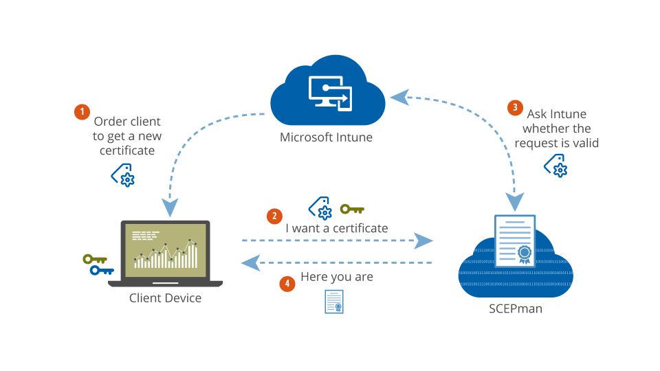

# Welcome


Intune service discovery API endpoint will require specific permissions starting January 1st 2023. You can find more details on this on the [Microsoft site](https://aka.ms/mem-servicediscovery-api-blog).

**SCEPman instances running versions prior to version 2.0 may have issues with this change.**&#x20;

Please ensure that you are using the [latest version of SCEPman](scepman-configuration/optional/update-strategy.md).


SCEPman is a slim and resource-friendly solution to issue and validate certificates using SCEP. **It is an Azure Web App providing the SCEP protocol and works directly with the Microsoft Graph and Intune API.** SCEPman uses an Azure Key Vault based Root CA and certificate creation. No other component is involved, neither a database nor any other stateful storage except the Azure Key Vault itself. That said, SCEPman **will not need any backup procedures** or other operation level tasks. Only an Azure subscription is necessary to deploy it.

The following documentation will show you a straightforward way to deploy certificates to modern cloud managed clients. Without any on-premises PKI your users and devices will be able to get certificates.


SCEPman 2.0 - What's new?


## Get more details about SCEPman


[details.md](details.md)



[editions.md](editions.md)


## SCEPman Guides

We offer two guides to deploy the SCEPman environment. Please follow below link for guidance on which guide is best suited for your scenario and deployment requirements:


[deployment-guides](scepman-deployment/deployment-guides/)


## Changelog

News from our development and our roadmap can be found under the **Changelog**.


[changelog.md](changelog.md)

