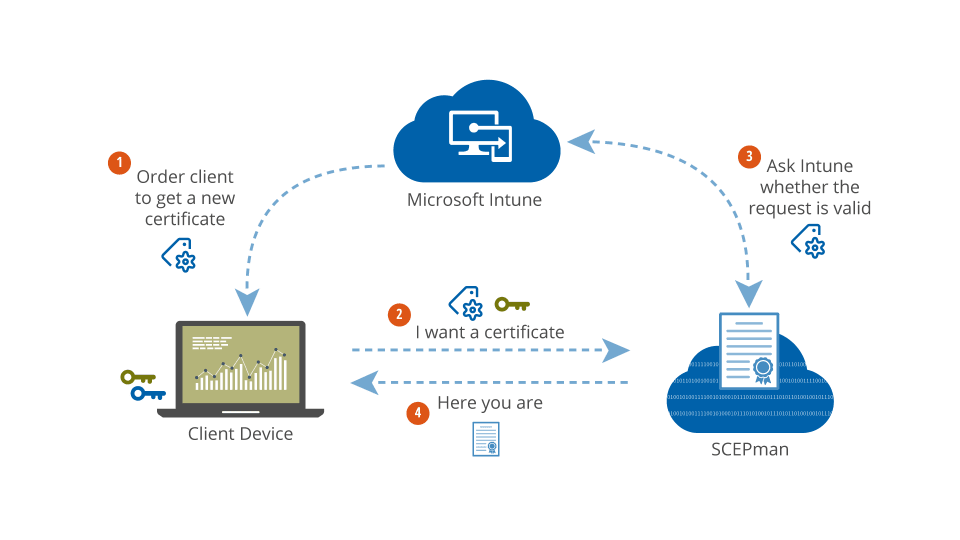

# SCEPman Documentation

## Overview

SCEPman is a slim and resource-friendly solution to issue and validate certificates using Simple Certificate Enrollment Protocol (SCEP). **It is an Azure Web App providing the SCEP protocol and works directly with the Microsoft Graph and Intune API.** SCEPman uses an Azure Key Vault based Root CA and certificate creation. By default, no other component is involved, neither a database nor any other stateful storage, except the Azure Key Vault itself. That said, SCEPman **will not need any backup procedures** or other operation level tasks. Only an Azure subscription is necessary to deploy it.

SCEPman gives you control over how and where data is processed and stored. Depending on the deployment model, SCEPman can run either within **your Azure tenant** or as a **managed SaaS offering**. No external vendor permissions in your tenant are required.

The following documentation will show you a straightforward way to deploy certificates to modern cloud managed clients. Without any on-premises PKI your users and devices will be able to get certificates.

## SCEPman vs. Legacy PKI

If you are interested in learning more about the effort involved in installing and operating a legacy/on-premises PKI such as the Certificate Connector for Intune / Active Directory Certificate Services (ADCS) in comparison to SCEPman, please refer to the article below.


[certificate-connector.md](other/faqs/certificate-connector.md)


## Get more details about SCEPman


SCEPman 2.0 - What's new?



[overview.md](overview.md)



[editions](editions/)


## SCEPman Guides

We offer two guides to deploy the SCEPman environment. Please follow the link below for guidance on which guide is best suited for your scenario and deployment requirements:


[deployment-guides](scepman-deployment/deployment-guides/)


## Change Log

News from our development and our roadmap can be found under the **Change Log**.


[changelog.md](changelog.md)

