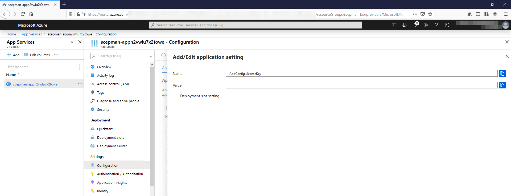

# License Key

To upgrade a Community Edition to an Enterprise Edition you have to add the license key in the app settings. How this works is explained in the following chapter:

1. Navigate to **App Services**.
2. Then choose your SCEPman app.
3. Next under **Settings** click **Configuration**.
4. Select **AppConfig:LicenseKey**.
5. Under **Value**, enter your license key.

6. Then, Save the settings and under Overview, restart your App Service.
7. After the restart, your SCEPman instance homepage shows that it is an Enterprise Edition.
8. Pay special attention that your SCEPman instance homepage shows on the left side that the Storage Account is connected (green bubble). If there are connection issues, the bubble is red and your OCSP responder will not work.