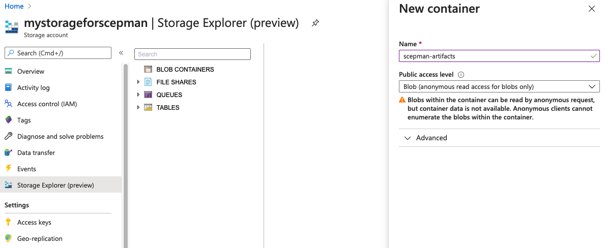

# Application Artifacts

## Available SCEPman Channels

We offer three channels for our SCEPman web applications, you can find the actual artifacts also on [Github](https://github.com/scepman/install/tree/master/dist). In order to receive updates from one of the update channels, copy the respective URL from below into the [WEBSITE\_RUN\_FROM\_PACKAGE](../scepman-configuration/optional/application-settings/basics.md#website\_run\_from\_package) setting of your SCEPman App Service.

There are two independent artifact hosts, GitHub and Azure (install.scepman.com). If one of the two should fail, you can switch to the other. Thus, there are two download URLs for each channel. Detecting the used channel when using install.scepman.com requires SCEPman 2.3, but apart from that also works with SCEPman 2.2.

### SCEPman Production Channel

* full released version
* function and load-tested
* bugs not expected

```
https://raw.githubusercontent.com/scepman/install/master/dist/Artifacts.zip
```

```
https://install.scepman.com/dist/Artifacts.zip
```

### SCEPman Beta Channel

* next production release
* function tested, but no load-test
* bugs possible

```
https://raw.githubusercontent.com/scepman/install/master/dist/Artifacts-Beta.zip
```

```
https://install.scepman.com/dist/Artifacts-Beta.zip
```

### SCEPman Internal Channel

* ongoing development
* limited function tested and no load-test
* bugs expected

```
https://raw.githubusercontent.com/scepman/install/master/dist/Artifacts-Intern.zip
```

```
https://install.scepman.com/dist/Artifacts-Intern.zip
```

### SCEPman Deferred Channel

* second-to-latest version
* function and load-tested
* does not include the latest bugfixes and features

```
https://raw.githubusercontent.com/scepman/install/deferred/dist/Artifacts.zip
```

## Available SCEPman Certificate Master Channels

We offer three channels for our SCEPman web applications, you can find the actual artifacts also on [Github](https://github.com/scepman/install/tree/master/dist-certmaster). In order to receive updates from one of the update channels, copy the respective URL from below into the [WEBSITE\_RUN\_FROM\_PACKAGE](../certmaster-configuration/application-settings/basics.md#website\_run\_from\_package) setting of your Certificate Master App Service.

### Certificate Master Production Channel

```
https://raw.githubusercontent.com/scepman/install/master/dist-certmaster/CertMaster-Artifacts.zip
```

```
https://install.scepman.com/dist-certmaster/CertMaster-Artifacts.zip
```

### Certificate Master Beta Channel

```
https://raw.githubusercontent.com/scepman/install/master/dist-certmaster/CertMaster-Artifacts-Beta.zip
```

```
https://install.scepman.com/dist-certmaster/CertMaster-Artifacts-Beta.zip
```

### Certificate Master Internal Channel

```
https://raw.githubusercontent.com/scepman/install/master/dist-certmaster/CertMaster-Artifacts-Intern.zip
```

```
https://install.scepman.com/dist-certmaster/CertMaster-Artifacts-Intern.zip
```

### Certificate Master Deferred Channel

```
https://raw.githubusercontent.com/scepman/install/deferred/dist-certmaster/CertMaster-Artifacts.zip
```

## Custom Artifact Location

To have full control over the update process and what artifacts are loaded by your App Service you can deploy your own Azure Storage Account. We recommend to use one of the update channels, so if this is not required, skip this section.

Follow these instructions to create a storage account:

1\. Start at your **Resource group** where you have deployed SCEPman and click **+ Add**

2\. Search for **storage account** in the Marketplace search bar and click on **Storage account - blob, file, table, queue**

3\. Your Subscription and resource group are pre-selected and you can start with defining **Storage account name, Location Performance, Account kind, Replication and Access tier** (Use settings as shown in the screenshot)

.png>)

4\. Go to the **Advanced** tab and set the **Blob public access** to **Enabled**

5\. Click on **Review + create** and then on **Create**

6\. After the successful creation of your storage account you can open the Storage account overview and open the **Storage Explorer (preview)**

7\. In the **Storage Explorer (preview)** you can right click on the **BLOB CONTAINERS** and select **Create blob container.** Specify a **Name** and set the **Public access level** to **Blob.** After this you can click on **Create**



8\. You need to reload the **Storage Explorer (Preview)** and then you can see your container under **BLOB CONTAINERS**. Now you can download the Artifacts from our GitHub (See [Application Artifacts](application-artifacts.md#available-channels)) and upload the artifacts here.

9\. After the successful upload you can select your blob and click on **Copy URL.** You need this URL in the Part **Change Artifacts (**[**Application Artifacts**](application-artifacts.md#change-artifacts)**)**

## Change Artifacts

To get continuous updates for SCEPman you can point a configuration variable to the [maintained GitHub repository](https://github.com/scepman/install) of SCEPman (**Evergreen Approach)**. During every restart, the Azure Web App will do a check and a copy deployment if necessary.


If you want to have more control over the updates you can use your own location.\
(See [Custom Artifact Location](application-artifacts.md#custom-artifact-location))


To configure this, do the following:

1. Go to your Azure portal
2. Navigate to **App Services**
3. Choose your SCEPman AppService
4. Then, click **Configuration** (submenu **Settings**)
5. Locate the parameter **WEBSITE\_RUN\_FROM\_PACKAGE** and click on it

 (3) (3) (3) (3) (3) (3) (2) (1) (1) (1) (1) (1) (1) (1) (1) (4) (2).png>)

6\. Then replace the URL in \*\*Value\*\* with the [SCEPman GitHub URL](application-artifacts.md#available-scepman-channels) (Evergreen Approach) or your Storage account blob URL you already copied:


7\. Repeat the steps 1. - 6. for the Certificate Master AppService, which provides the same **WEBSITE\_RUN\_FROM\_PACKAGE** parameter under **Configuration**. Remember to provide the [CertMaster GitHub URL](application-artifacts.md#available-certificate-master-channels) in case you are following our Evergreen Approach.
