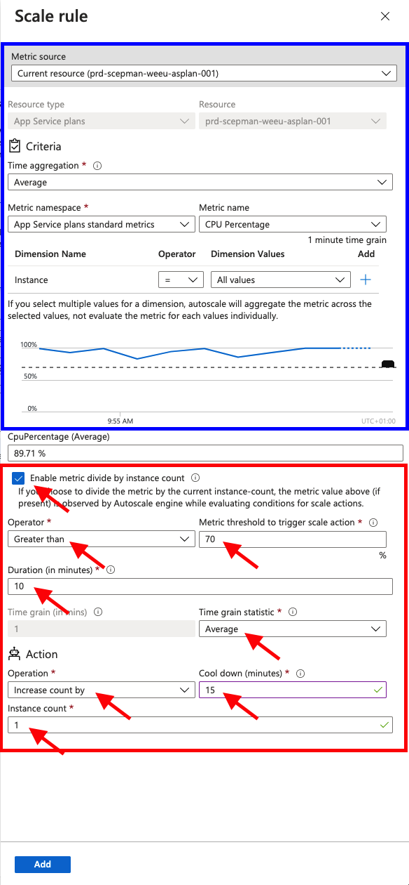

# Autoscaling

To activate autoscaling navigate to the **Scale out (App Service plan)** in the navigation pane of your SCEPman App Service.

 (1).png>)


Please ensure that your App Service plan uses at least the **S1** pricing tier. Otherwise, the App Service plan will not provide multiple instances.


### Autoscale Conditions

To scale the instance count based on the current load of the service there must be two scaling rule conditions added. One rule to increase the instance count on heavy load and one rule to decrease the instance count after the load is reduced again.

 (1).png>)

* Select **Custom autoscale**
* Type in an appropriate name in **Autoscale setting name**
* Select **Scale based on a metric** to enable autoscaling based on a defined rule set
* Set the instance limits:
  * Minimum
  * Maximum
  * Default
* **Add a rule** once to increase the instance count and once to decrease the instance account


We recommend the following settings of the increase and decrease rules.\
But please keep in mind that this can depend on your workload and needs to be monitored and optimized!


#### Increase Instance Count Rule

1. **Enable metric divided by instance count**
2. Choose **Greater than** as the Operator and set the threshold to **70** (percent)
3. Set the duration to **10** (minutes)
4. Ensure that the **Time grain statistic** is set to **Average**
5. Ensure that the **Operation** is set to **Increase count by**
6. Set the **Cool down (minutes)** to **15** (minutes)
7. Check the **Instance count (1)** that will be added to the current instances

#### Decrease Instance Count Rule

1. **Enable metric divided by instance count**
2. Choose **Less than** as the Operator and set the threshold to **35** (percent)
3. Set the duration to **20** (minutes)
4. Ensure that the **Time grain statistic** is set to **Average**
5. Ensure that the **Operation** is set to **Decrease count by**
6. Set the **Cool down (minutes)** to **30** (minutes)
7. Check the **Instance count (1)** that will be removed from the current instances

