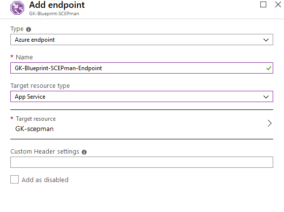

# Geo-redundancy


SCEPman Enterprise Edition only


This reference architecture shows how to run an Azure App Service application in multiple regions to achieve high availability.

## Architecture


As illustrated above, the geo-redundant deployment leverages an Azure Traffic Manager profile, that routes (DNS-based) requests to the SCEPman CA to a pair of SCEPman instances that are deployed in different geolocations. The individual SCEPman instances communicate with the same KeyVault, Storage Account and AAD and thus share the same Root CA. Besides load-balancing traffic based on a set of routing algorithms that you can choose from, Traffic Manager also constantly probes both instances of SCEPman. In case an instance becomes unavailable, all traffic will automatically be routed to the available instance.

Microsoft discusses in [this article](https://docs.microsoft.com/en-us/azure/architecture/reference-architectures/app-service-web-app/multi-region) three different Geo-Redundancy strategies that can be used to manage this type of architecture. However, In our case we will use the **Active/Active** approach. This means both regions are active, and requests are load-balanced between them. If one region becomes unavailable or has some latency for any reason, Traffic Manager will route the traffic to the second App Service.

## Workflow

* First, we will start with cloning the App Service
* Then create and configure the Traffic Manager and its Endpoints
* Finally, configuring the custom domains for both App Services

### Clone App

To clone an App Service, first you need to create a new **App Service Plan** in a second Geolocation, this is where the cloned App will be deployed. You can create it in the same SCEPman Resource group or in a new one. See screenshot below



App Service Clone requirements (via [SCEPman PowerShell Module](../scepman-configuration/post-installation-config.md#acquire-and-run-the-scepman-installation-powershell-module)):

* SCEPman **2.2** or above
* SCEPman PowerShell Module **1.6.3.0** or above
* Global Admin permissions


The following CMDlet command will clone your SCEPman App Service and configure all required permissions

```
New-SCEPmanClone -SourceAppServiceName <Your SCEPman App Service Name> -TargetAppServiceName <Your cloned App Service Name> -TargetAppServicePlan <Your second App Service Plan in the second Geo Location> -SearchAllSubscriptions 6>&1
```

**SourceAppServiceName:** The name of the existing SCEPman App Service.

**TargetAppServiceName:** The name of the newly cloned SCEPman App Service.

**TargetAppServicePlan:** The name of the App Service Plan for the cloned SCEPman instance. The App Service Plan must exist already in the TargetResourceGroup.

**SourceResourceGroup:** (Optional) The Azure resource group hosting the existing SCEPman App Service. Leave empty for auto-detection.

**TargetResourceGroup:** (Optional) The Azure resource group hosting the new SCEPman App Service. Leave empty to auto-detect the resource group of the App Service Plan.

**SourceSubscriptionId:** (Optional) The ID of the Subscription where SCEPman is installed. Can be omitted if it is pre-selected in az already or use the SearchAllSubscriptions flag to search all accessible subscriptions

**TargetSubscriptionId:** (Optional) The ID of the Subscription where SCEPman shall be installed. Can be omitted if it is the same as SourceSubscriptionId.

**SearchAllSubscriptions:** (Optional) Set this flag to search all subscriptions for the SCEPman App Service. Otherwise, pre-select the right subscription in az or pass in the correct SubscriptionId.

### **Example**

Clone an existing SCEPman App Service "as-scepman-nrg5reuov63vk"

```
New-SCEPmanClone -SourceAppServiceName as-scepman-nrg5reuov63vk -TargetAppServiceName as-scepman-clone -TargetAppServicePlan asp-scepman-geo2 -SearchAllSubscriptions 6>&1
```


After the deployment is finished successfully, navigate to the cloned app and check the SCEPman homepage that all permissions are set correctly and everything is green and connected (this could take \~ 3 minutes after the deployment is done).



To avoid a single point of failure, we recommend setting the [WEBSITE\_RUN\_FROM\_PACKAGE](application-artifacts.md) of the cloned App Service to the second independent artifact host in Azure.

Production channel:

`https://install.scepman.com/dist/Artifacts.zip`

The origin App Service should have the first artifact host by default, which points to a GitHub repository. For more information please check [Application Artifacts](application-artifacts.md)



Cloning an app service has some restrictions such as **autoscale** settings, **backup schedule** settings, **App Insights, logging**, etc.. so you have to configure them again (if needed) for the new cloned app service. Additionally, changes to the settings of one AppService will not be automatically synchronized to the second AppService if performed after the cloning operation. For more info visit [https://docs.microsoft.com/en-us/azure/app-service/app-service-web-app-cloning#current-restrictions](https://docs.microsoft.com/en-us/azure/app-service/app-service-web-app-cloning#current-restrictions)


### Setup Traffic Manager

Follow the steps below to create and configure the Traffic Manager and balance the traffic between both SCEPman instances:

1. Search **Traffic Manager profile** and click **Create**.
2. Fill in the fields.


1. Then click **Create**.
2. After your Traffic Manager is deployed, go to it and click **Configuration** under settings.
3. Change the settings as follows:


1. Save changes.

#### First Endpoint

1. Then under **Settings** choose **Endpoints**
2. Click **Add** and choose the primary App Service.



#### Second Endpoint

Repeat these steps for your second App Service.

#### DNS Configuration

In the **Overview** your Traffic Manager should be like this (here you find the Traffic Manager URL):

.png>)

* Navigate to your **App Service** for the cloned SCEPman instance
* Under **Custom Domains**, create an SSL certificate and set the binding process as described [here](../scepman-configuration/optional/custom-domain.md#SSL-Binding)
* Both instances of SCEPman must have the same custom domain
* Navigate to your DNS management service (e.g. **Azure DNS Zones**)
* There shall be a CNAME entry for the custom SCEPman domain that maps to the Traffic Manager endpoint. Remove any possibly existing wrong CNAME entry pointing to one of the Azure App Service instances and add a CNAME that maps the custom SCEPman domain to the Traffic Manager endpoint now, e.g. your entry scepman.customer.com should point to something like scepman-tf-profile.trafficmanager.net


In **Azure DNS Zone**, in order to modify a record, you first have to remove the DNS lock by navigating to **Locks**.


### Custom Domain Configuration

After successful deployment and configuration of the Traffic Manager profile, we highly recommend setting up custom domains for **both** SCEPman instances as described [here](../scepman-configuration/optional/custom-domain.md). The custom domains have the following requirements attached to them:

* The custom domains of both instances of SCEPman have to be **the same**.
* Both custom domains should point to the Traffic Manager (see screenshot below)
* The custom domains have to be equal to the custom domain mapped to the Traffic Manager endpoint from above.

<figure><figcaption></figcaption></figure>

### Storage Account Geo-Redundancy

The Storage Account used for SCEPman should also be configured for redundancy. The default SCEPman setup uses Locally Redundant Storage (LRS), which uses only a single region. For example, configure Geo-redundant storage (GRS).


