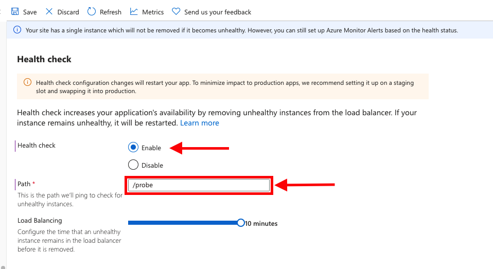
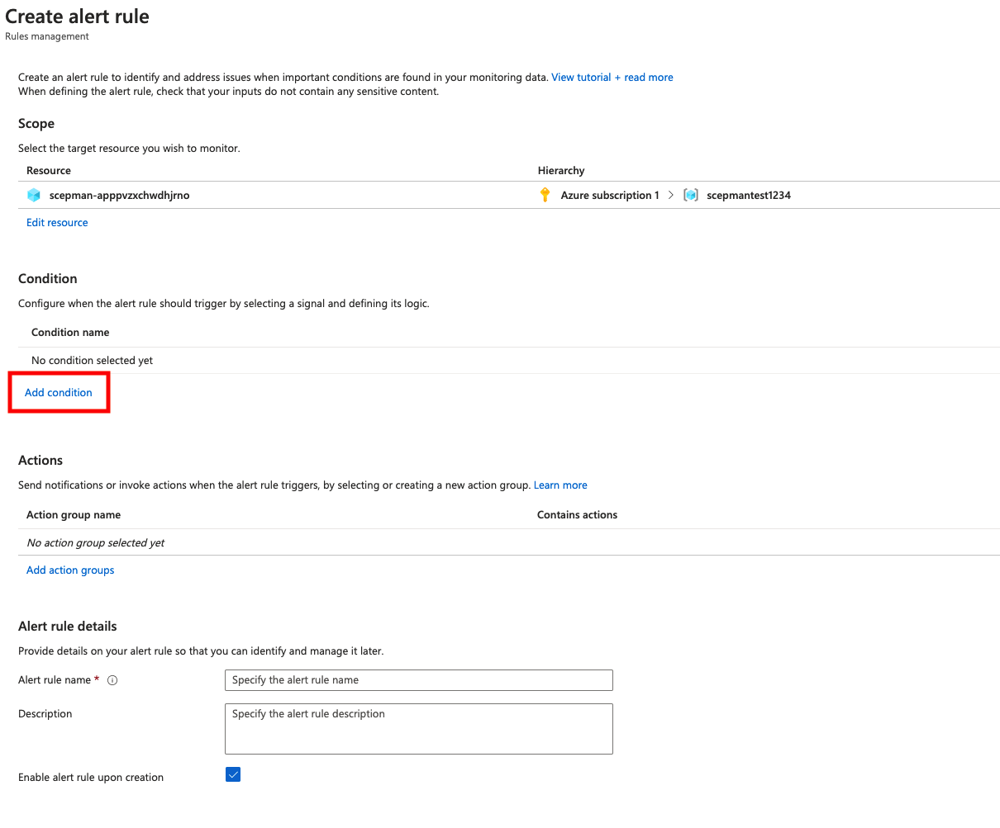
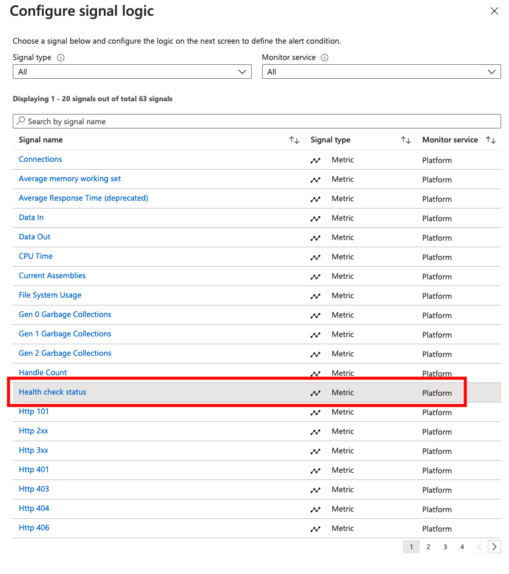
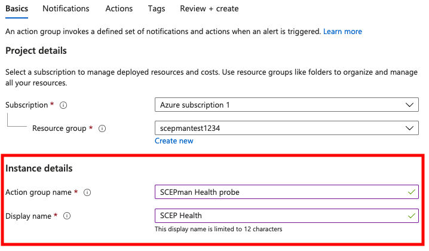

# Health Check

You may configure the health check feature and corresponding alerting for the App Service to get a direct notification in case your SCEPman instance is no longer responsive.


After you have configured the health check and Alerting correctly it takes some time until the alert rule works properly. It is because the metric **Health check status** needs some time to get the information and the dynamic alert rule threshold needs some time to analyze the metric.


## Configure Health Check

1. Navigate to your **App Service** and on the left side scroll down to **Health check**
2. Now you can **Enable** the Health check, as probing **path** enter the following: **/probe**
3. Now you can click on **Save**, but keep in mind that **this will restart your App Service**

## Configure Alerting

To get an alert from our health check we need to configure alert rules in our App Service.

1. Navigate to your **App Service** and on the left side scroll down to **Alerts**
2. Click on **New alert rule**
3. In your new alert rule you can now click on **Add condition**

4\. **** You must select a signal logic. Search for **Health check status**

5\. Now you can switch the **Threshold** to **Dynamic**\
****6. Change the **Threshold Sensitivity** to **High**\
****7. Select **15 minutes** as the **Aggregation granularity (Period)**\
****8. **** After that click on **Done**

&#x20;9\. Now we need to click on **Add action groups**

10\. If you do not have any action groups available, you can click on **Create action group**

11\. Define an **Action group name** and **Display name**

12\. Go to **Notifications** and add **Notification type**\
13\. In the windows select **Email** and enter your email address that you want to get the notifications\
14\. Then click on **OK**\
15\. Enter a **Name** for the Notification type

16\. After that you can click on **Review + create** and then on **Create**\
****17. At least you must enter an **Alert rule name**, define the **Severity** and **Enable alter rule upon creation**\
18\. Then click on **Create alert rule**

| Back to Trial Guide | [Back to Community Guide](../scepman-deployment/deployment-guides/community-guide.md#step-8-configure-health-check) | ​[Back to Enterprise Guide​](../scepman-deployment/deployment-guides/enterprise-guide.md#step-11-configure-intune-deployment-profiles) |
| ------------------- | ------------------------------------------------------------------------------------------------------------------- | -------------------------------------------------------------------------------------------------------------------------------------- |
