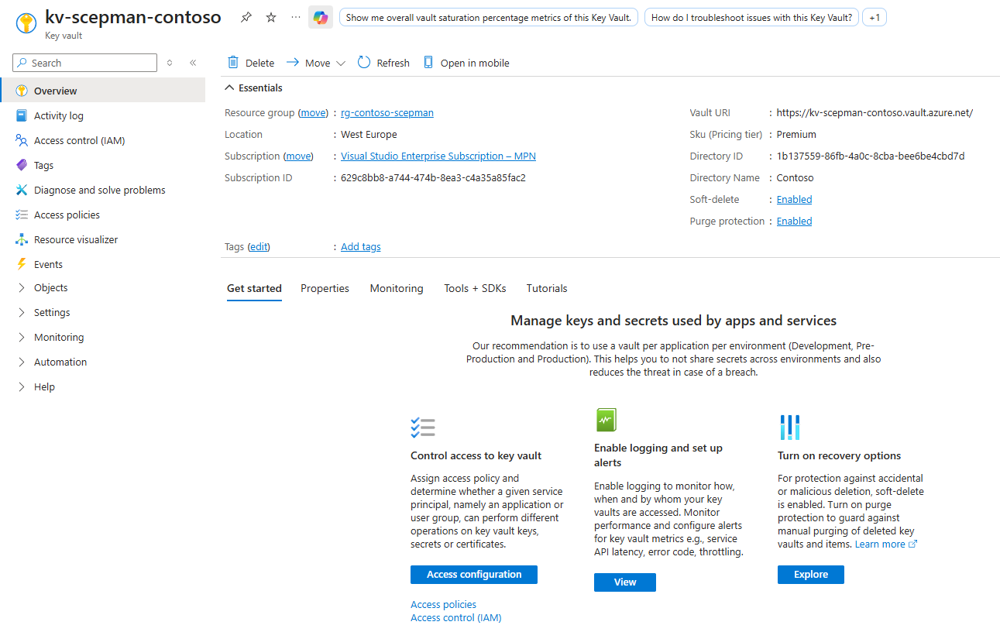

# Private Endpoints

When installing SCEPman 2.8 or newer, the Storage Account and Key Vault will be connected to a VNET through Private Endpoints. Access to the data of these two Azure Resources is only possible through this VNET, unless you define exceptions.

This VNET is located in the same resource group as the other SCEPman components. The SCEPman and SCEPman Certificate Master App Services are connected to the VNET and, on a network level, have access to the Storage Account and the Key Vault.

After installation, there are no exceptions configured, so no other entity can access the Key Vault certificates and keys or the Table Storage of the Storage Account. If required, for example when [generating a Subordinate CA](../scepman-deployment/intermediate-certificate.md) or when[ querying the Storage Account](../other/faqs/general.md#how-can-i-programmatically-query-the-storage-account-table), you need to add exceptions under the Networking blade of the respective Azure Resource.

Access to the management interface of the Key Vault and Storage Account is unaffected, i.e. you don't need to add your admin machines to the exception list to perform functions such as changing the SKU of your Storage Account or inspecting the access logs of your Key Vault. Of course, you can use Conditional Access to restrict access to the Azure Portal.

The SCEPman and SCEPman Certificate Master App Services do not have Private Endpoints, even if you install SCEPman 2.8 or newer. They can still be accessed from the Internet without networking restrictions. We recommend not restricting access to SCEPman on a networking level, as SCEPman is usually part of the infrastructure used to establish network connections and should therefore be available even if you are not yet connected.

If needed, Conditional Access can be employed to limit access to SCEPman Certificate Master with various restrictions, including networking conditions. SCEPman usually does not use Conditional Access, as the two endpoints SCEP and OCSP do not use Entra authentication. However, you might use Conditional Access to restrict access to [SCEPman's REST API](../certificate-management/api-certificates/).

### Azure Resources Used for Private Endpoints

<table><thead><tr><th width="217">Type</th><th>Description</th></tr></thead><tbody><tr><td>Virtual Network</td><td>The SCEPman App Services, the Key Vault, and the Storage Account connect over this VNET.</td></tr><tr><td>Private Endpoint (×2)</td><td>One for the Key Vault and one for the Storage Account. It makes them accessible over the VNET.</td></tr><tr><td>Private DNS zone (×2)</td><td>One for the Key Vault and one for the Storage Account. They both have an internal IP address in the VNET, for which they have a name in their respective Private DNS zone.</td></tr><tr><td>Network Interface (×2)</td><td>One for the Key Vault and one for the Storage Account. It connects the Private Endpoint to the VNET.</td></tr></tbody></table>

### Adding Private Endpoints to Existing SCEPman Installations

If you have installed SCEPman 2.7 or older, your Key Vault and Storage Account won't automatically have Private Endpoints, even if you update to SCEPman 2.8 or newer. You have to add them manually after a conscious decision. Please follow this guide to do so:

* **Create Virtual Network**:
  * In the SCEPman resource group, create a virtual network using default settings or as required by your organisation.
  * Create a new subnet in the new **Virtual Network** with default settings and set **"Subnet Delegation"** as **Microsoft.Web\&serverfarms**

<figure><figcaption></figcaption></figure>

* **Create KeyVault Private Endpoint**:
  * Navigate to your SCEPman's Resource Group > **KeyVault** > Settings > Networking > Private endpoint connections, and create a private endpoint
  * Select resource type: **Microsoft.KeyVault/vaults**
  * Select your **KeyVault** by Resource and **vault** for Target sub-resource
  * Choose the virtual network and the default subnet (not the subnet created in the first step)
  * Enable **Integrate with private DNS zone** to automatically create and connect the Private DNS zone
* **Create Storage Account Private Endpoint**
  * Navigate to **StorageAccount** > Security + Networking > Networking > Private endpoint connections and create a Private endpoint
  * By resource, set target sub-resource to **table**
  * Choose your virtual network and default subnet
  * Enable **Integrate with private DNS zone** to automatically create and connect the Private DNS zone
* **Integrate SCEPman App Service**:
  * Navigate to **SCEPman App service** > Networking > Add virtual network integration to the **Outbound traffic configuration** by clicking on "Not configured"
  * Select the virtual network and the created subnet from the first step.
  * Uncheck the option "Outbound internet traffic" and apply

<figure><figcaption></figcaption></figure>

<figure><figcaption></figcaption></figure>

* **Integrate Certificate Master App Service**:
  * By adding the virtual network integration to the second app service, you can select the previous connection from the list, you don't have to create a new connection.
  * If enabled, uncheck the option "Outbound internet traffic" and apply

<figure><figcaption></figcaption></figure>

Now verify that the private endpoints for both the Key Vault and Storage Account are approved.&#x20;

<figure><figcaption></figcaption></figure>

Once confirmed, you can disable public access for both, Key vault and Storage account.

<figure><figcaption></figcaption></figure>

For testing, you can create a new client certificate in Certificate Master, see [Client Certificate](../certificate-management/certificate-master/client-certificate-pkcs-12.md)

