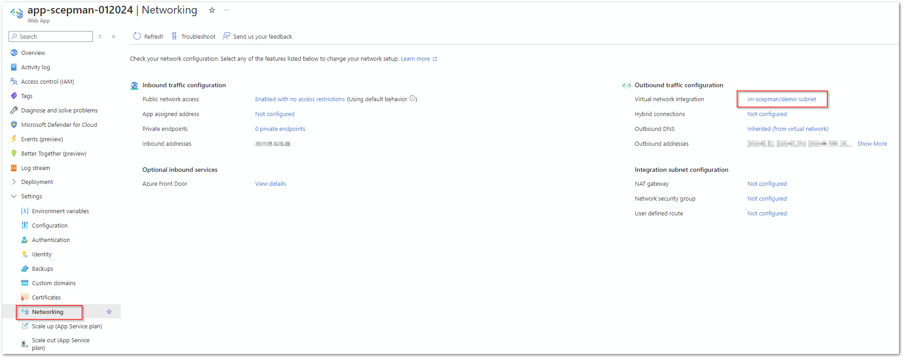

# Devices

Please follow this guide to distribute certificates to devices (e.g.: iOS, iPadOS). Before deploying the first certificates via Jamf, follow the [general steps for Jamf](general.md) first.


We strongly recommend to configure all use-case relevant certificate payloads (trusted certificate / SCEP certificate) in a **single** Configuration Profile in Jamf.&#x20;


## SCEPman Root Certificate

As first step you need to deploy SCEPman root certificate. Download this CA certificate via SCEPman dashboard:

Add a new "Mobile Device Configuration Profile" and choose "Certificate" as payload. Enter a meaningful name and upload the certificate (for "Select Certificate Option" select "Upload):

.png>)

## Device Certificate

Please add another "Mobile Device Configuration Profile" and choose "SCEP" as payload. Activate "Use the External Certificate Authority settings to enable Jamf Pro as SCEP proxy for this configuration profile" and enter the following information:

| Field                | Description                                     | Value/Example                                |
| -------------------- | ----------------------------------------------- | -------------------------------------------- |
| Name                 | name/purpose                                    | e.g. "Device Authentication"                 |
| Redistribute Profile | re-deploys profile for renewal                  | e.g. "14 days"                               |
| Subject              | subject for certificate, additions are possible | CN=$JSSID,OU=devices,CN=$PROFILE\_IDENTIFIER |

.png>)

Distribute the profile to your clients as desired.
