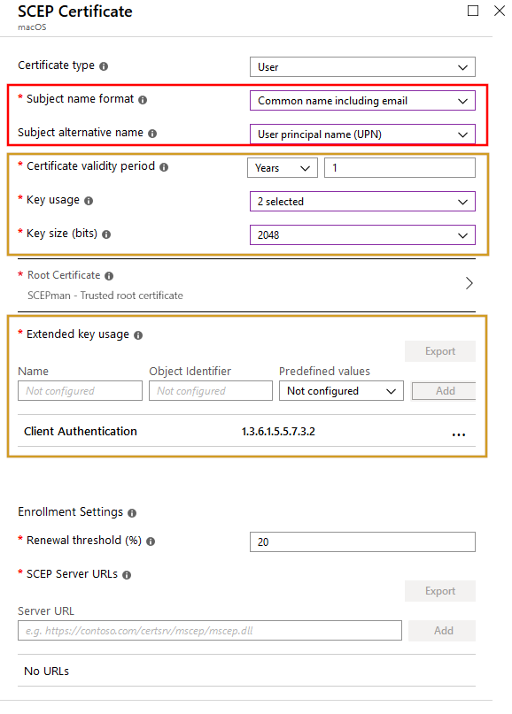

# MacOS

The following article describes how to deploy a device certificate or a user certificate for MacOS.

## Deploying Device Certificates

The following section will show you how you can deploy user certificates via Intune Certificate profile on macOS X 10.12 \(or later\) devices.

First, we need to trust the public root certificate from SCEPman. Therefore, you have to download the CA certificate \(from SCEPman\) and deploy it via a trusted certificate profile in Microsoft Intune:

Download the CA certificate:

Then, create a profile in Microsoft Intune:

1. Enter a **Name**
2. As **Platform** select **macOS**
3. As **Profile type** select **Trusted certificate**
4. Click **Settings**, select **A valid .cer file**
5. Then, click **OK**
6. Finally, click **Create**

When you are done with it, you can deploy this profile to your devices.

Now, you have to create a SCEP certificate profile to deploy the device certificates. Important for this step is the SCEP Server URL. This URL can be found in the **Overview** submenu of the app service of SCEPman:

Append the following to your URL: **/certsrv/mscep/mscep.dll**. Note this URL: [https://scepman-xxx.azurewebsites.net/certsrv/mscep/mscep.dll](https://scepman-xxx.azurewebsites.net/certsrv/mscep/mscep.dll)  
\('xxx' is a placeholder\)

Next, to finally deploy the device certificates you have to create a SCEP certificate profile in Intune:

1. Navigate to **Microsoft Intune**
2. Click **Device Configuration**
3. Choose **Profile** and click **Create profile**
4. Then, enter a **Name**
5. Select **macOS** as **Platform**
6. Select **SCEP certificate** as **Profile type**
7. Click **Settings**

1. Configure the **SCEP Certificate**


You can not configure all **SCEP Certificate** settings. This is because some settings are mandatory set by SCEPman, the yellow rectangle is automatically to set by SCEPman \(for better visibility I recommend to set the settings in the yellow rectangle to the SCEPman mandatory settings like shown below\). Hereby is the Key usage set to **Digital signature** and **Key encipherment**. The validity period is set to fixed a 6 month currently. The red rectangle is a setting that is free to modify. Long term all settings will be supported for configuration. **There is a dependency on the {{AAD\_Device\_ID} in the subject name, which is used as a seed for the certificate serial number generation. Therefore the subject name must include**.

With our automatically set settings, we fulfill Apple's certificate requirements. For more details click [here](https://support.apple.com/en-us/HT210176).


1. Scroll down and enter the URL you have noted
2. Then, click **Add**
3. Next click **OK** and finally click **Create**

When all its is done, you have the following two certificate configurations:

* SCEPman - SCEP device certificate
* SCEPman - Trusted root certificate

## Deploying User Certificates

The following section will show you how you can deploy user certificates via Intune Certificate profile on macOS X 10.12 \(or later\) devices.

First, we need to trust the public root certificate from SCEPman. Therefore, you have to download the CA certificate \(from SCEPman\) and deploy it via a trusted certificate profile in Microsoft Intune:

Download the CA certificate:

Then, create a profile in Microsoft Intune:

1. Enter a **Name**
2. As **Platform** select **macOS**
3. As **Profile type** select **Trusted certificate**
4. Click **Settings**, select **A valid .cer file**
5. Then, click **OK**
6. Finally, click **Create**

When you are done with it you can deploy this profile to your devices.

Now, you have to create a SCEP certificate profile to deploy the device certificates. Important for this step is the SCEP Server URL. This URL can be found in the **Overview** submenu of the app service of SCEPman:

Append the following to your URL: **/certsrv/mscep/mscep.dll**. Note this URL: [https://scepman-xxx.azurewebsites.net/certsrv/mscep/mscep.dll](https://scepman-xxx.azurewebsites.net/certsrv/mscep/mscep.dll)  
_\*\*_\('xxx' is a placeholder\)

Next, to finally deploy the device certificates you have to create a SCEP certificate profile in Intune:

1. Navigate to **Microsoft Intune**
2. Click **Device Configuration**
3. Choose **Profile** and click **Create profile**
4. Then, enter a **Name**
5. Select **macOS** as **Platform**
6. Select **SCEP certificate** as **Profile type**
7. Click **Settings**

1. Configure the **SCEP Certificate**


You can not configure all **SCEP Certificate** settings. This is because some settings are mandatory set by SCEPman, the yellow rectangle is automatically set by SCEPman \(for better visibility I recommend to set the settings in the yellow rectangle to the SCEPman mandatory settings like shown below\). Hereby is the Key usage set to **Digital signature** and **Key encipherment**. The validity period is set to fixed a 6 month currently. The red rectangle is a settings that is free to modify. Long term all settings will be supported for configuration. **The setting for 'Subject name format' is freely selectable. For Subject alternative name we recommend to set 'User principal name \(UPN\)'.**

With our automatically set settings, we fulfill Apple's certificate requirements. For more details click [here](https://support.apple.com/en-us/HT210176).


1. Scroll down and enter the URL you have noted
2. Then, click **Add**
3. Next click **OK** and finally click **Create**

When all its done, you have the following two certificate configurations:

* SCEPman - SCEP user certificate
* SCEPman - Trusted root certificate

| ​[Back to Trial Guide​](../../deployment/trial-guide.md#step-4-configure-intune-deployment-profiles) | [Back to Community Guide](../../deployment/community-guide.md#step-9-configure-intune-deployment-profiles) | ​[Back to Enterprise Guide​](../../deployment/enterprise-guide.md#step-11-configure-intune-deployment-profiles) |
| :--- | :--- | :--- |

