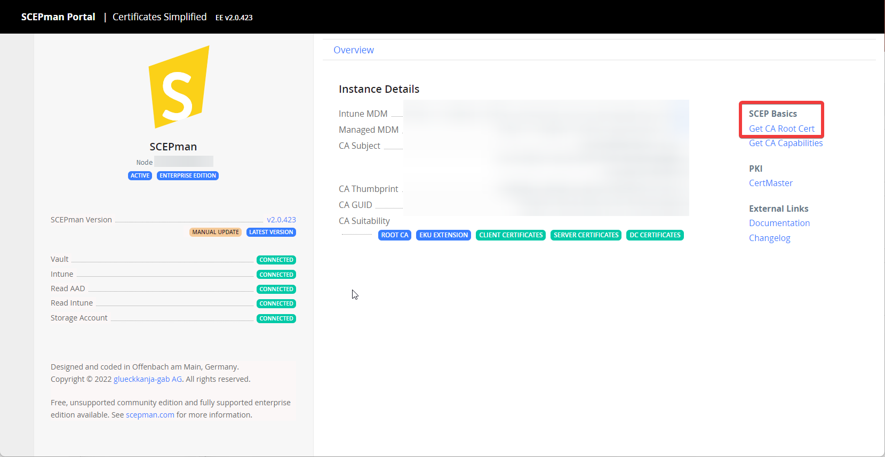
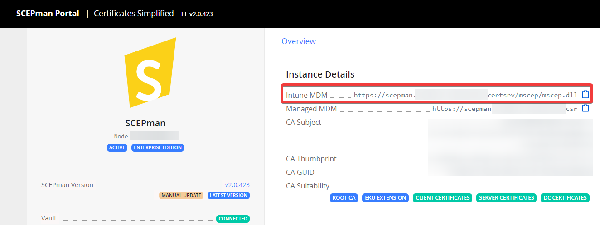

# macOS

The following article describes how to deploy a device or/and user certificates for macOS devices. The deployment of the SCEPman Root Certificate is mandatory. Afterward, you can choose between deploying only device, user or even both certificate types.


Please note that macOS enrols a separate client authentication certificate for each device configuration profile in which a SCEP profile is referenced, in addition to the actual SCEP certificate profile.


## Root Certificate

The basis for deploying SCEP certificates is to trust the root certificate of SCEPman. Therefore, you have to download the CA Root certificate and deploy it as a **Trusted certificate** profile via Microsoft Intune:

* [ ] Download the CA Certificate from SCEPman portal:



* [ ] Create a profile for macOS with type **Trusted certificate** in Microsoft Intune:


* [ ] Upload your previously downloaded **.cer file**.
* [ ] Now you can deploy this profile to your devices. Please choose All Users and/or All Devices or a dedicated group for assignment.


Note, that you have to use the **same group for assigning** the **Trusted certificate** and **SCEP profile**. Otherwise, the Intune deployment might fail.


## Device certificates

* [ ] Open the SCEPman portal and copy the URL under **Intune MDM**:



* [ ] Create a profile for macOS with type **SCEP certificate** in Microsoft Intune:


* [ ] Configure the profile as described:

<details>

<summary>Certificate type: <code>Device</code></summary>

In this section we are setting up a device certificate.

</details>

<details>

<summary>Subject name format: <code>CN={{DeviceName}}</code> or <code>CN={{DeviceId}}</code> or <code>CN={{AAD_Device_ID}}</code></summary>

**Recommended:** Use `{{DeviceName}}`for the CN RDN to have a meaningful name of the certificate on the device or when searching for the certificate.

**Optional:** If configured to `CN={{DeviceId}}` or `CN={{AAD_Device_ID}}`,  SCEPman uses the CN field of the subject name to identify the device and as a seed for the certificate serial number generation. Microsoft Entra ID (Azure AD) and Intune offer two different IDs:

* `{{DeviceId}}`: This ID is generated and used by Intune.\
  \
  (requires SCEPman 2.0 or higher and [#appconfig-intunevalidation-devicedirectory](../../scepman-configuration/optional/application-settings/intune-validation.md#appconfig-intunevalidation-devicedirectory "mention") to be set to **Intune** or **AADAndIntune**)

<!---->

* `{{AAD_Device_ID}}`: This ID is generated and used by Microsoft Entra ID (Azure AD).

In case neither `CN={{DeviceId}}` nor `CN={{AAD_Device_ID}}` is used for the CN field (e.g. `CN={{DeviceName}})`, SCEPman will identify the device based on the Intune Device ID (`(URI)Value:`   `IntuneDeviceId://{{DeviceId}}`) provided in the subject alternative name (SAN).

**Important:** The choice of the CN field affects the [automatic revocation behavior](../manage-certificates.md#automatic-revocation) of certificates issued to your Intune-managed devices.

You can add other RDNs if needed (e.g.: `CN={{DeviceId}}, O=Contoso, CN={{WiFiMacAddress}}`). Supported variables are listed in the [Microsoft docs](https://docs.microsoft.com/en-us/mem/intune/protect/certificates-profile-scep#create-a-scep-certificate-profile).

</details>

<details>

<summary>Subject alternative name: <code>URI</code> Value:<code>IntuneDeviceId://{{DeviceId}}</code></summary>

The URI field is [recommended by Microsoft](https://techcommunity.microsoft.com/t5/intune-customer-success/new-microsoft-intune-service-for-network-access-control/ba-p/2544696) for NAC solutions to identify the devices based on their Intune Device ID.

The **URI field is mandatory** in case neither `CN={{DeviceId}}` nor `CN={{AAD_Device_ID}}` is used in the **Subject name format** field.

Other SAN values like DNS can be added if needed.

</details>

<details>

<summary>Certificate validity period: <code>1 years</code></summary>

<mark style="color:orange;">**Important:**</mark> <mark style="color:orange;"></mark><mark style="color:orange;">macOS devices ignore the configuration of the validity period via Intune. Please make sure, to configure</mark> [#appconfig-validityperioddays](../../scepman-configuration/optional/application-settings/certificates.md#appconfig-validityperioddays "mention") <mark style="color:orange;">to a fixed value. You can leave the certificate validity period setting to 1 year because it will be ignored anyway.</mark>\
\
<mark style="color:orange;">**Important:**</mark> <mark style="color:orange;"></mark><mark style="color:orange;">Also note, that</mark> <mark style="color:orange;"></mark><mark style="color:orange;">**certificates on macOS are only renewed**</mark> <mark style="color:orange;"></mark><mark style="color:orange;">by Intune when the device is</mark> <mark style="color:orange;"></mark><mark style="color:orange;">**unlocked, online, syncing and in scope of the renewal threshold**</mark><mark style="color:orange;">. If certificates are expired (e.g.: device was offline and/or locked for a long time), they won't be renewed any more. Therefore, we recommend to choose an higher value here.</mark>

</details>

<details>

<summary>Key usage: <code>Digital signature</code> and <code>key enciphermen</code>t</summary>

Please activate both cryptographic actions.

</details>

<details>

<summary>Key size (bits): <code>2048</code></summary>

SCEPman supports 2048 bits.

</details>

<details>

<summary>Root Certificate: <code>Profile from previous step</code></summary>

Please select the Intune profile from [#Root certificates](macos.md#root-certificate)

</details>

<details>

<summary>Extended key usage: <code>Client Authentication, 1.3.6.1.5.5.7.3.2</code></summary>

Please choose **Client Authentication (1.3.6.1.5.5.7.3.2)** under **Predefined values**. The other fields will be filled out automatically.

<mark style="color:orange;">**Important:**</mark> <mark style="color:orange;"></mark><mark style="color:orange;">macOS devices do not support any Extended Key Usages (EKUs) other than</mark> <mark style="color:orange;"></mark><mark style="color:orange;">`Client Authentication`</mark> <mark style="color:orange;"></mark><mark style="color:orange;">. This means that any other EKUs configured in this profile will be ignored.</mark>

</details>

<details>

<summary>Renewal threshold (%): <code>50</code></summary>

This value defines when the device is allowed to renew its certificate (based on remaining lifetime of existing certificate). Please read the note under **Certificate validity period** and select a suitable value that allows the device the renew the certificate over a long period. A value of 50% would allow the device with a 1 years valid certificate to start renewal 182 days before expiration.

</details>

<details>

<summary>SCEP Server URLs: Open the SCEPman portal and copy the URL of <a href="macos.md#device-certificates"><strong>Intune MDM</strong></a></summary>

**Example**

```
https://scepman.contoso.com/certsrv/mscep/mscep.dll
```

</details>


With our stated settings, we fulfill [Apples certificate requirements](https://support.apple.com/en-us/HT210176).


### Example

<figure><figcaption></figcaption></figure>

* [ ] Now you can deploy this profile to your devices. Please choose the same group/s for assignment as for the Trusted certificate profile.

## User Certificates

The following section will show you how you can deploy user certificates via Intune Certificate profile on macOS X 10.12 (or later) devices.


Please note: Certificates provisioned through the SCEP protocol - regardless of the type (user or device) - are always placed in the system keychain (System store) of the device.

In case a 3rd party application requires access to such a certificate (e.g. 3rd party VPN client), the slider to **Allow all apps access to private key** in the keychain must be set to **enabled**.


Please follow the instructions of [#Device certificates](macos.md#device-certificates) and take care of the following differences:

<details>

<summary>Certificate type: <code>User</code></summary>

In this section we are setting up a user certificate.

</details>

<details>

<summary>Subject name format: <code>CN={{UserName}},E={{EmailAddress}}</code></summary>

You can define RDNs based on your needs. Supported variables are listed in the [Microsoft docs](https://docs.microsoft.com/en-us/mem/intune/protect/certificates-profile-scep#create-a-scep-certificate-profile). We recommend to include the username (e.g.: janedoe) and email address (e.g.: janedoe@contoso.com) as baseline setting.

</details>

<details>

<summary>Subject alternative name: <code>UPN</code> Value:<code>{{UserPrincipalName}}</code></summary>

SCEPman uses the UPN in the SAN to identify the user and as a seed for the certificate serial number generation (e.g.: janedoe@contoso.com).\
\
Other SAN values like Email address can be added if needed.

</details>


With our stated settings, we fulfill [Apples certificate requirements](https://support.apple.com/en-us/HT210176)


### Example


