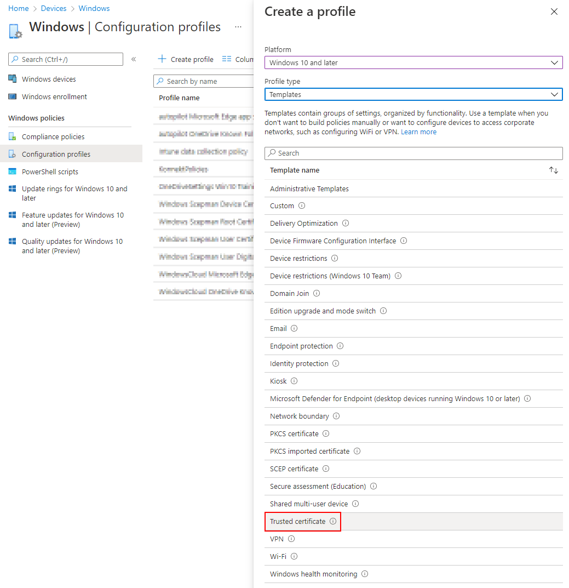
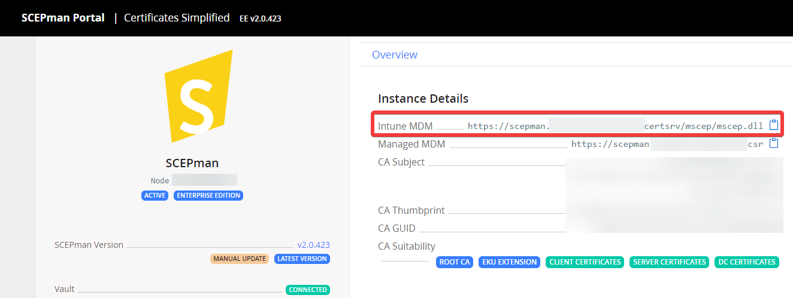
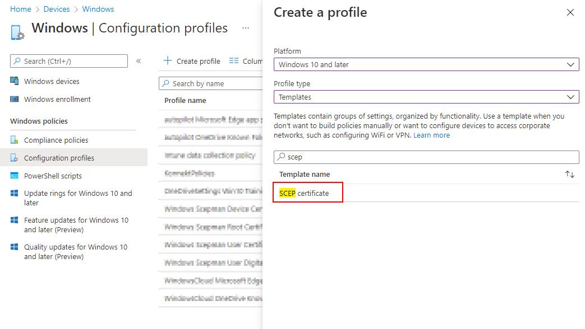
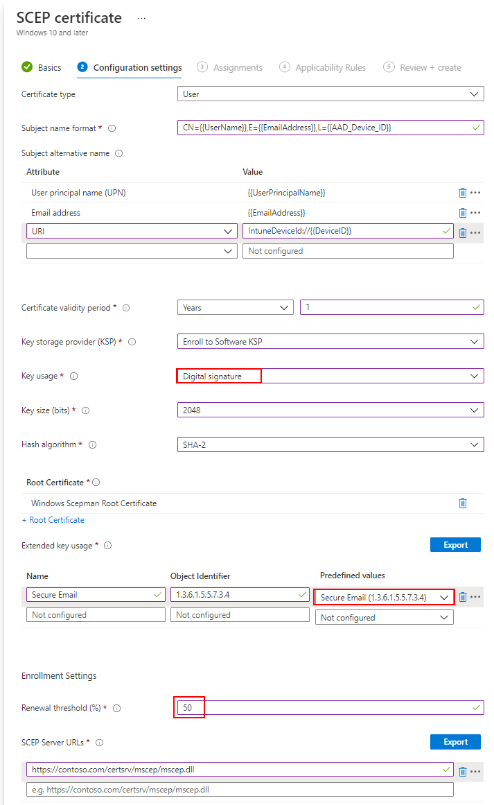

# Windows 10

The following article describes how to deploy a device or/and user certificates for Windows 10 devices. The deployment of the SCEPman Root Certificate is mandatory. Afterward, you can choose between deploying only device, user or even both certificate types.

## Root Certificate

The basis for deploying SCEP certificates is to trust the public root certificate of SCEPman. Therefore, you have to download the CA Root certificate and deploy it as a **Trusted certificate** profile via Microsoft Intune:

* [ ] Download the CA Certificate from SCEPman portal:

 (1) (1) (1) (1) (1) (1) (1).png>)

* [ ] Create a profile for **Windows 10 and later** with type **Trusted certificate** in Microsoft Intune:



* [ ] Upload your previously downloaded **.cer file**.
* [ ] Now you can deploy this profile to your devices. Please choose All Users and/or All Devices or a dedicated group for assignment.


Note that you have to use the same group for assigning the Trusted certificate and SCEP profile. Otherwise, the Intune deployment might fail.


## Device Certificates

* [ ] Open the SCEPman portal and copy the URL under Intune MDM



* [ ] Create a profile for **Windows 10 and later** with type **SCEP certificate** in Microsoft Intune



* [ ] Configure the profile as described:

<details>

<summary>Certificate type: <code>Device</code></summary>

In this case we are setting up a device certificate

</details>

<details>

<summary>Subject name format: <code>CN={{DeviceId}}</code> or <code>CN={{AAD_Device_ID}}</code></summary>

SCEPman uses the CN field of the subject to identify the device and as a seed for the certificate serial number generation. Azure AD and Intune offer two different IDs:

* \{{DeviceId\}}: This ID is generated and used by Intune **(Recommended)**\
  \
  (requires SCEPman 2.0 or higher and [#appconfig-intunevalidation-devicedirectory](../../scepman-configuration/optional/application-settings/intune-validation.md#appconfig-intunevalidation-devicedirectory "mention") to be set to **Intune** or **AADAndIntune**)

<!---->

* \{{AAD\_Device\_ID\}}: This ID is generated and used by Azure AD.\


You can add other RDNs if needed (e.g.: `CN={{DeviceId}}, O=Contoso, CN={{WiFiMacAddress}}`). Supported variables are listed in the [Microsoft docs](https://docs.microsoft.com/en-us/mem/intune/protect/certificates-profile-scep#create-a-scep-certificate-profile).

</details>

<details>

<summary>Subject alternative name: <code>(URI)</code>Value:<code>IntuneDeviceId://{{DeviceId}}</code></summary>

The URI field is [recommended by Microsoft](https://techcommunity.microsoft.com/t5/intune-customer-success/new-microsoft-intune-service-for-network-access-control/ba-p/2544696) for NAC solutions to identify the devices based on their Intune Device ID.

Other SAN values like DNS can be added if needed.

</details>

<details>

<summary>Certificate validity period: <code>1 year</code></summary>

The amount of time remaining before the certificate expires. Default is set at one year.

SCEPman caps the certificate validity to the configured maximum in setting [_**AppConfig:ValidityPeriodDays**_](../../scepman-configuration/optional/application-settings/certificates.md#appconfig-validityperioddays), but otherwise uses the validity configured in the request.

</details>

<details>

<summary>Key storage provider (KSP): <code>Enroll to Software KSP</code></summary>

This setting determines the storage location of the private key for the end-user certificates. Storage in the TPM is more secure than software storage because the TPM provides an additional layer of security to prevent key theft. However, there is **a bug in some older TPM firmware versions** that invalidates some signatures created with a TPM-backed private key. In such cases, the certificate cannot be used for EAP authentication as it is common for Wi-Fi and VPN connections. Affected TPM firmware versions include:

* STMicroelectronics: 71.12, 73.4.17568.4452, 71.12.17568.4100
* Intel: 11.8.50.3399, 2.0.0.2060
* Infineon: 7.63.3353.0

If you use TPM with this firmware, either update your firmware to a newer version or select "Software KSP" as a key storage provider.

</details>

<details>

<summary>Key usage: <code>Digital signature</code> and <code>Key encipherment</code></summary>

Please activate both cryptographic actions.

SCEPman automatically sets the Key usage to **Digital signature** and **Key encipherment** and overrides the setting here unless the setting [_**AppConfig:UseRequestedKeyUsages**_](../../scepman-configuration/optional/application-settings/certificates.md#appconfig-userequestedkeyusages) is set to _true_.

</details>

<details>

<summary>Key size (bits): <code>2048</code></summary>

SCEPman supports 2048 bits.

</details>

<details>

<summary>Hash algorithm: <code>SHA-2</code></summary>

SCEPman supports SHA-2 algorithm.

</details>

<details>

<summary>Root Certificate: <code>Profile from previous step (Root certificate Profile)</code></summary>

Please select the Intune profile from [#Root Certificate](windows-10.md#root-certificate).

</details>

<details>

<summary>Extended key use: <code>Client Authentication, 1.3.6.1.5.5.7.3.2</code></summary>

Please choose **Client Authentication (1.3.6.1.5.5.7.3.2)** under **Predefined values**. The other fields will be filled out automatically.

</details>

<details>

<summary>Renewal threshold (%): <code>20</code></summary>

This value defines when the device is allowed to renew its certificate (based on the remaining lifetime of an existing certificate). Please read the note under **Certificate validity period** and select a suitable value that allows the device the renew the certificate over a long period. A value of 20% would allow the device with 1 year valid certificate to start renewal 73 days before expiration.

</details>

<details>

<summary>SCEP Server URLs: Open the SCEPman portal and copy the URL of <a href="windows-10.md#device-certificates">Intune MDM</a></summary>

**Example**

```
https://scepman.contoso.com/certsrv/mscep/mscep.dll
```

</details>

### Example


* [ ] Now you can deploy this profile to your devices. Please choose the same group/s for assignment as for the Trusted certificate profile.

## User Certificates

Please follow the instructions of [#Device certificates](windows-10.md#device-certificates) and take care of the following differences:

<details>

<summary>Certificate type: <code>User</code></summary>

In this section we are setting up a user certificate.

</details>

<details>

<summary>Subject name format: <code>CN={{UserName}},E={{EmailAddress}}</code></summary>

You can define RDNs based on your needs. Supported variables are listed in the [Microsoft docs](https://docs.microsoft.com/en-us/mem/intune/protect/certificates-profile-scep#create-a-scep-certificate-profile). We recommend to include the username (e.g.: janedoe) and email address (e.g.: janedoe@contoso.com) as baseline setting.

</details>

<details>

<summary>Subject alternative name: <em><code>(UPN)</code></em> Value: <em><code>{{UserPrincipalName}}, (URI)</code></em>Value: <em><code>IntuneDeviceId://{{DeviceID}}</code></em></summary>

You must add the User principal name as the Subject alternative name. **Add '\{{UserPrincipalName\}}' as Subject Alternative Name of type User principal name (UPN).** This ensures that SCEPman can link certificates to user objects in AAD. The setting for 'Subject name format' is freely selectable.

The URI field is [recommended by Microsoft](https://techcommunity.microsoft.com/t5/intune-customer-success/new-microsoft-intune-service-for-network-access-control/ba-p/2544696) for NAC solutions to identify the devices based on their Intune Device ID.

Other SAN values like an Email address can be added if needed.

</details>

### Example


## User Digital Signature Certificate

You may use SCEPman for transnational **digital signatures** i.e. for S/MIME signing in Microsoft Outlook. If you plan to use the certificates for message signing you need to add the corresponding extended key usages in the Intune profile configuration.


**Do not** use SCEPman **for email-encryption** i.e. for S/MIME mail encryption in Microsoft Outlook (without a separate technology for key management). The nature of **the SCEP protocol does not include a mechanism to backup or archive private key material.** If you would use SCEP for email-encryption you may lose the keys to decrypt the messages later.


* [ ] You must set these configuration variables otherwise the requested key usage and extended validity period in the SCEP profile is not honored by SCEPman:\


<!---->

* [_`AppConfig:UseRequestedKeyUsages`_](../../scepman-configuration/optional/application-settings/certificates.md#appconfig-userequestedkeyusages) set to _`true`_
* [_`AppConfig:ValidityPeriodDays`_](../../scepman-configuration/optional/application-settings/certificates.md#appconfig-validityperioddays) _set to `365` (a maximum value of 1825 - 5 years is possible)_

To deploy user certificates used for **Digital Signatures** please follow the instructions of [#User certificates](windows-10.md#user-certificates) and take care of the following differences and notes:

<details>

<summary>Subject alternative name</summary>

* **(required) User principal name (UPN):** _`{{UserPrincipalName}}`_
* **(required) Email address:** _`{{EmailAddress}}`_
* **(optional) URI:** _`IntuneDeviceId://{{DeviceID}}`_

By deploying a digital signature certificate, you must add the UPN and the email address, URI DeviceID is optional.

</details>

<details>

<summary>Key usage: only <em><code>Digital signature</code></em></summary>


</details>

<details>

<summary>Extended key usage: <em><code>Secure Email (1.3.6.1.5.5.7.3.4)</code></em></summary>

Please choose **Secure Email (1.3.6.1.5.5.7.3.4)** under **Predefined values**. The other fields will be filled out automatically.

</details>

<details>

<summary>Renewal Threshold (%): <em><code>50</code></em></summary>

We recommend setting Renewal Threshold (%) to a value that ensures certificates are renewed at least 6 months before expiration when issuing S/MIME signature certificates. This is because emails signed with expired certificates are shown to have invalid signatures in Outlook, which confuses users. Having a new certificate long before the old one expires ensures that only older emails show this behavior, which users are more unlikely to look at. For example, if your signature certificates are valid for one year, you should set the Renewal Threshold to at least 50 %.

</details>

### **Example**



****

After a successful profile sync, you should see the user certificate for Intended Purposes **Secure Email**

.png>)

The certificate will be available for Digital Signature usage in e.g. Outlook. Below is an example of the usage


