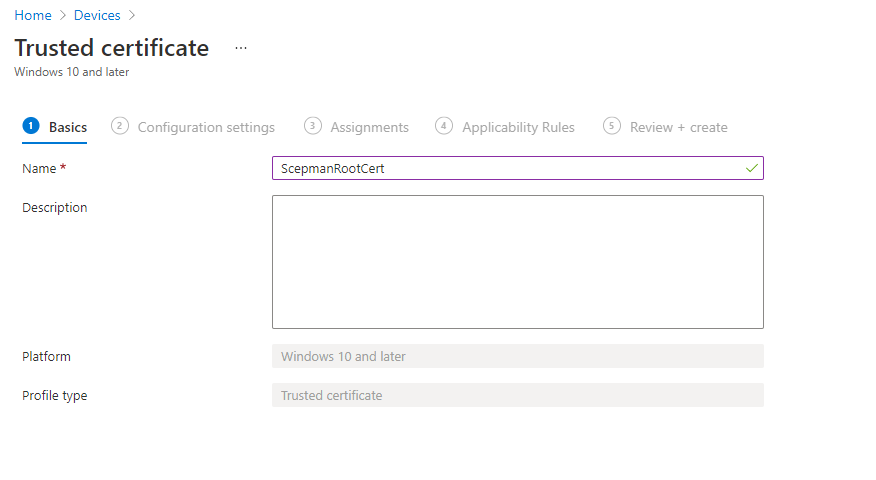
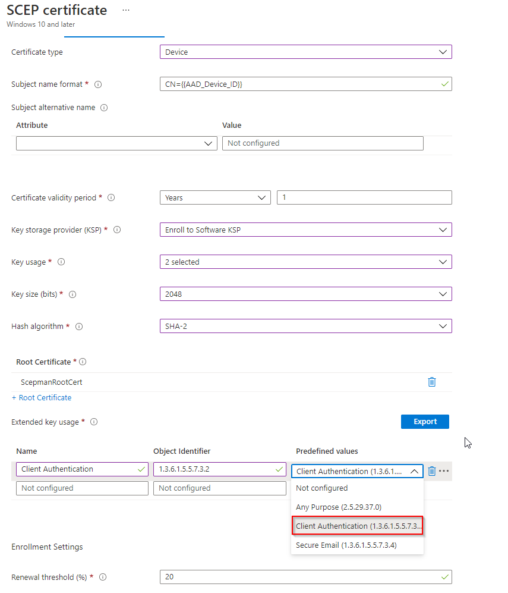

# Windows 10

The following article describes how to deploy a device certificate or a user certificate for Windows 10.

## Deploy Root CA Certificate

First, we need to trust the public root certificate from SCEPman. Therefore, you must download the CA certificate \(from SCEPman\) and deploy it via a trusted certificate profile in Microsoft Intune:

Download the CA certificate:

Then, create a profile in Microsoft Intune:

1. Navigate to **Microsoft Intune**
2. Click **Devices**
3. Click **Configuration profiles**
4. Click + **Create profile**

Choose the following profile setting:

1. Enter a **Name**
2. As **Platform** select **Windows 10 or later**
3. As **Profile type** select **Templates** then select **Trusted certificate**
4. Click **Create**

Now you will get the following window:

1. Choose a profile name and **Next**
2. select **A valid .cer file** which you already downloaded
3. As **Destination store** select **Computer certificate store - Root** and **Next**
4. Include the devices and users you want, **Next**
5. Applying **Applicability Rules** is optional, **Next**
6. Finally, click **Create**

When you are finished with it, you can deploy this profile to your devices.

## Deploy Device Certificates

Now, you must create a SCEP certificate profile to deploy the device certificates. Important for this step is the SCEP Server URL. This URL can be found in the **Overview** submenu of the app service of SCEPman:

Append the following to your URL: **/certsrv/mscep/mscep.dll**. Note this URL: [https://scepman-xxx.azurewebsites.net/certsrv/mscep/mscep.dll](https://scepman-xxx.azurewebsites.net/certsrv/mscep/mscep.dll)  
\('xxx' is a placeholder\)

Next, to finally deploy the device certificates, you must create a SCEP certificate profile in Intune:

1. Navigate to **Microsoft Intune**
2. Click **Devices**
3. Click **Configuration profiles**
4. Click + **Create profile**
5. Select **Windows 10 and later** as **Platform**
6. Select **Templates** as **Profile type**
7. Select **SCEP certificate** from the Template name list
8. Click **Create**
9. Provide a **Name** e.g. _\*\*Win10 - SCEP certificate - Device certificate_

Set the properties like shown below.


There are some restrictions to the **SCEP Device Certificate** settings:

**Important**: You must add the AAD Device ID to the subject. **Add '' as CN in the field Subject name format** or alternatively add the device ID as SAN UPN. This ensures that SCEPman can link certificates to device objects in AAD.

SCEPman automatically sets the Key usage to **Digital signature** and **Key encipherment** and overrides the setting here unless the setting _AppConfig:UseRequestedKeyUsages_ is set to _true_.

SCEPman caps the certificate validity to the configured maximum in setting _AppConfig:ValidityPeriodDays_, but otherwise uses the validity configured in the request.



The setting Key Storage Provider \(KSP\) determines the storage location of the private key for the end-user certificates. Storage in the TPM is more secure than software storage, because the TPM provides an additional layer of security to prevent key theft. However, there is **a bug in some older TPM firmware versions** that invalidates some signatures created with a TPM-backed private key. In such cases, the certificate cannot be used for EAP authentication as it is common for Wi-Fi and VPN connections. Affected TPM firmware versions include:

* STMicroelectronics: 71.12, 73.4.17568.4452
* Intel: 11.8.50.3399, 2.0.0.2060
* Infineon: 7.63.3353.0

If you use TPM with this firmware, either update your firmware to a newer version or select "Software KSP" as key storage provider.


* Scroll down and enter the URL you have noted
* Then, click **Next**
* Assign Users and Devices, click **Next**
* **Applicability Rules** is Optional, **Next**
* Finally click **Create**

When all is finished, you have the following two certificate configurations:

* SCEPman - SCEP device certificate
* SCEPman - Trusted root certificate

## Deploy User Authentication Certificates

The following section will show you how you can deploy user certificates via Intune Certificate profile on Windows 10 \(or later\) devices.

First, we need to trust the public root certificate from SCEPman.  
Therefore follow the instructions [here](windows-10.md#deploy-root-ca-certificate).

Now, you must create a SCEP certificate profile to deploy the user certificates. Important for this step is the SCEP Server URL. This URL can be found in the **Overview** submenu of the app service of SCEPman:

Append the following to your URL: **/certsrv/mscep/mscep.dll**. Note this URL: [https://scepman-xxx.azurewebsites.net/certsrv/mscep/mscep.dll](https://scepman-xxx.azurewebsites.net/certsrv/mscep/mscep.dll)  
\('xxx' is a placeholder\)

Next, to finally deploy the user certificates you must create a SCEP certificate profile in Intune:

1. Navigate to **Microsoft Intune**
2. Click **Devices**
3. Click **Configuration profiles**
4. Click + **Create profile**
5. Select **Windows 10 and later** as **Platform**
6. Select **Templates** as **Profile type**
7. Select **SCEP certificate** from the Template name list
8. Click **Create**
9. Provide a **Name** e.g. _\*\*Win10 - SCEP certificate - User certificate_

Set the properties like shown below.


There are some restrictions to the **SCEP User Certificate** settings:

You must add the User principal name as Subject alternative name. **Add '' as Subject Alternative Name of type User principal name \(UPN\).** This ensures that SCEPman can link certificates to user objects in AAD. The setting for 'Subject name format' is freely selectable.

You should **add 'L='** as part of the Subject. This ensures the user certificate can be linked to the device where it resides on. This may improve revocation and compliance checks.

SCEPman automatically sets the Key usage to **Digital signature** and **Key encipherment** and overrides the settings configured here unless the setting _AppConfig:UseRequestedKeyUsages_ is set to _true_.

For SCEPman version before 1.5, the validity period is set to a fixed 6 month. For SCEPman 1.5 and above, SCEPman caps the certificate validity to the configured maximum in setting _AppConfig:ValidityPeriodDays_, but otherwise uses the validity configured in the request.



The setting Key Storage Provider \(KSP\) determines the storage location of the private key for the end-user certificates. Storage in the TPM is more secure than software storage, because the TPM provides an additional layer of security to prevent key theft. However, there is **a bug in some older TPM firmware versions** that invalidates some signatures created with a TPM-backed private key. In such cases, the certificate cannot be used for EAP authentication as it is common for Wi-Fi and VPN connections. Affected TPM firmware versions include:

* STMicroelectronics: 71.12
* Intel: 11.8.50.3399, 2.0.0.2060
* Infineon: 7.63.3353.0

If you use TPMs with this firmware, either update your firmware to a newer version or select "Software KSP" as key storage provider.


* Scroll down and enter the URL you have noted, Click **Next**
* Assign users and groups, click **Next**
* Finally click **Create**

When all its done, you have the following two certificate configurations:

* SCEPman - SCEP Device certificate
* SCEPman - Trusted root certificate

## Deploy User Digital Signature Certificate

Deploying user certificates used for **Digital Signatures** can be achieved by following these instructions.


**You may** use SCEPman for transactional **digital signatures** i.e. for S/MIME signing in Microsoft Outlook. If you plan to use the certificates for message signing you need to add the corresponding extended key usages in the Intune profile configuration.

**Do not** use SCEPman **for email-encryption** i.e. for S/MIME mail encryption in Microsoft Outlook \(without a separate technology for key management\). The nature of **the SCEP protocol does not include a mechanism to backup or archive private key material.** If you would use SCEP for email-encryption you may lose the keys to decrypt the messages later.


You must set these configuration variables otherwise the requested key usage and extended validity period in the SCEP profile is not honored by SCEPman:


_AppConfig:UseRequestedKeyUsages_ set to _true  
AppConfig:ValidityPeriodDays set to 365 \(a maximum value of 1825 - 5 years is possible\)_


Another requirement is trusted root certificate of SCEPman, it must be deployed like described in the user or device certificate deployment section above to be referenced in this new digital signature profile.

To deploy the user digital signature certificate, you must create a SCEP certificate profile in Intune:

1. Navigate to **Microsoft Intune**
2. Click **Devices**
3. Click **Configuration profiles**
4. Click + **Create profile**
5. Select **Windows 10 and later** as **Platform**
6. Select **Templates** as **Profile type**
7. Select **SCEP certificate** from the Template name list
8. Click **Create**
9. Provide a **Name** e.g. _\*\*Win10 - SCEP certificate - Digital Signature_

Set the properties like shown below. Have special attention for the Key Usage select _only_ '**Digital Signature**' and for the Extended key usage '**Secure Email**'.

Assign the profile to your user group and wait for the device to synchronize. After successful sync you should see the user certificate for Intended Purposes **Secure Email**

The certificate will be available for Digital Signature usage in e.g. Outlook. Below an example of the usage:

| ​[Back to Trial Guide​](../../scepman-deployment/trial-guide.md#step-4-configure-intune-deployment-profiles) | [Back to Community Guide](../../scepman-deployment/community-guide.md#step-9-configure-intune-deployment-profiles) | ​[Back to Enterprise Guide​](../../scepman-deployment/enterprise-guide.md#step-11-configure-intune-deployment-profiles) |
| :--- | :--- | :--- |

