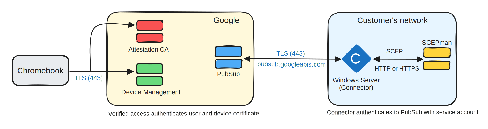

# Google Workspace


This feature requires version 1.6 or above.



SCEPman Enterprise Edition only


## Workflow of issuing SCEP Certificates&#x20;

1. Chromebook generates a hardware-backed private key.
2. Google generates a CSR with the SCEP profile.
3. Connector forwards the CSR to SCEPman.
4. SCEPman signs the CSR and sends the signed CRS back to the connector which forwards it to PubSub.
5. PubSub sends the signed CRS to device management for temporary storage.
6. Device management sends the signed CRS to the Chromebook where it is merged with the harware-backed private key. The signed CSR is deleted from temporary storage.

## Prerequisites

### Google Workspace

This guide assumes that you already provisioned Chromebook computer(s) running ChromeOS version 89 or later managed with **Chrome Enterprise**.&#x20;

<figure><figcaption>
Minimum subscriptions required
</figcaption></figure>

### Google Cloud Certificate Connector (GCCC)

#### **Prerequisites**

* The GCCC requires a Windows Server appliance or VM running Windows Server 2016 or later.
* The Windows Server instance must have the following network access:
  * Outbound: HTTP (80) and HTTPS (443).

#### **Installation of the GCCC**

1. In your Google **Admin console** (at admin.google.com) > Go to **Menu** > **Devices** > **Network**
2. Click **Secure SCEP** > **Download Connector**.
3. In the **Google Cloud Certificate Connector** section, click **Download**. The download creates a folder on your desktop that contains the certificate connector. We recommend you download the other connector configuration files to this folder.
4. In the **Download the connector configuration file** section, click **Download**. The `config.json` file downloads.
5. In the **Get a service account key** section, click **Generate key**. The `key.json` file downloads.
6. Run the certificate connector installer.
   1. In the installation wizard, click **Next**.
   2. Accept the terms of the license agreement and click **Next**.
   3. Choose the account that the service is installed for and click **Next**. The account must have privileges to sign in as a service on the Windows server.
   4. Select the installation location. We recommend using the default. Click **Next**.
   5. Enter your service account credentials and click **Next**. The service installs.
   6. Click **Finish** to complete the installation.
7. Move the configuration and key files (`config.json` and `key.json`) into the GCCC folder created during installation, typically: `C:\Program Files\Google Cloud Certificate Connector`.
8. Launch the Google Cloud Certificate Connector service:
   1. Open Windows Services.
   2. Select **Google Cloud Certificate Connector** in the list of services.
   3. Click **Start** to start the service. Ensure that the status changes to **Running**. The service automatically restarts if the computer reboots.


If you download a new service account key later, restart the service to apply it.


### SCEPman

Enable Google Workspace Integration by adding the following environment variables on SCEPman app service:


You can differentiate between the SCEPman App Service and the Certificate Master by looking for the App Service **without** the "-cm" in its name


|                                                                                             Setting                                                                                             | Description                                                                                                                                                                                                                                                                                                 |                     Value                    |
| :---------------------------------------------------------------------------------------------------------------------------------------------------------------------------------------------: | ----------------------------------------------------------------------------------------------------------------------------------------------------------------------------------------------------------------------------------------------------------------------------------------------------------- | :------------------------------------------: |
|                        [AppConfig:StaticValidation:Enabled](../../../advanced-configuration/application-settings/static-validation.md#appconfig-staticvalidation-enabled)                       | Enable 3rd-party validation                                                                                                                                                                                                                                                                                 | _**true**_ to enable, _**false**_ to disable |
|                [AppConfig:StaticValidation:RequestPassword](../../../advanced-configuration/application-settings/static-validation.md#appconfig-staticvalidation-requestpassword)               | 
Certificate signing requests sent to SCEPman for signing are authenticated with this secure static password  <strong>Recommendation</strong>: Store this secret in <a href="../../../advanced-configuration/application-settings/#secure-configuration-in-azure-key-vault">Azure KeyVault</a>.
 |      _generate a 32 character password_      |
|       [AppConfig:StaticValidation:ValidityPeriodDays](../../../advanced-configuration/application-settings/static-validation.md#appconfig-staticvalidation-validityperioddays) (optional)       | Days certificates issued via Google Workspace are valid                                                                                                                                                                                                                                                     |                      365                     |
| [AppConfig:StaticValidation:EnableCertificateStorage](../../../advanced-configuration/application-settings/static-validation.md#appconfig-staticvalidation-enablecertificatestorage) (optional) | Store requested certificates in the Storage Account, in order to show them in SCEPman Certificate Master                                                                                                                                                                                                    | _**true**_ to enable, _**false** to disable_ |


For more information and references please visit [Google Workspace Admin Help](https://support.google.com/a/answer/9366164?hl=en\&fl=1\&sjid=2941552975651362083-NC) or download the original PDF guide [Configuring Certificate Enrollment for ChromeOS via SCEP](https://support.google.com/chrome/a/answer/11338941?hl=en).

_Google, Google Workspace, ChromeOS and related marks and logos are trademarks of Google LLC._&#x20;


