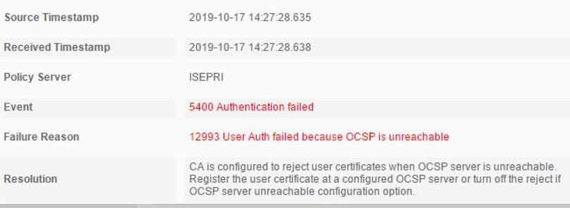
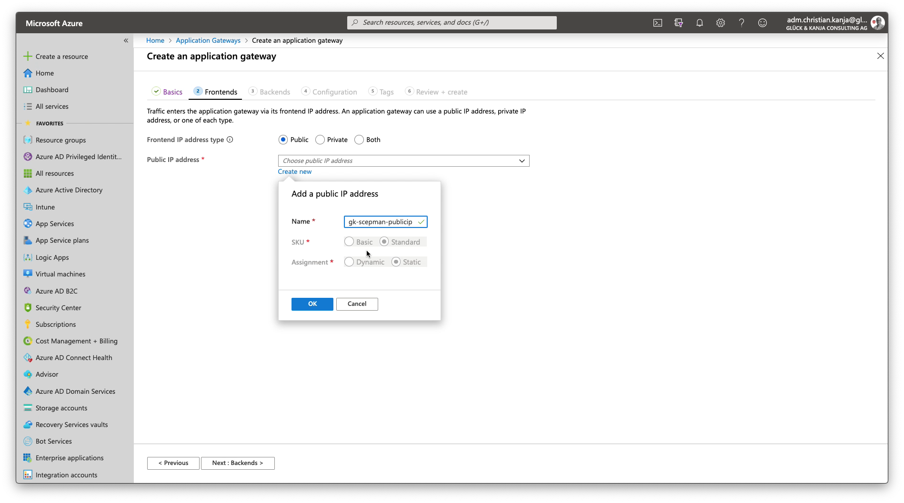
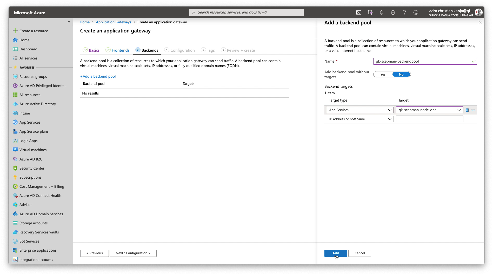
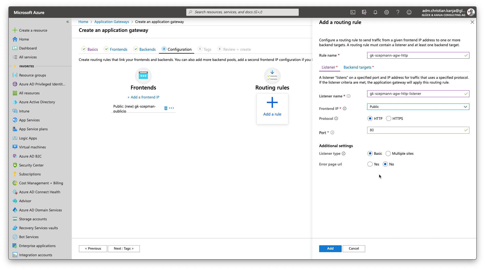
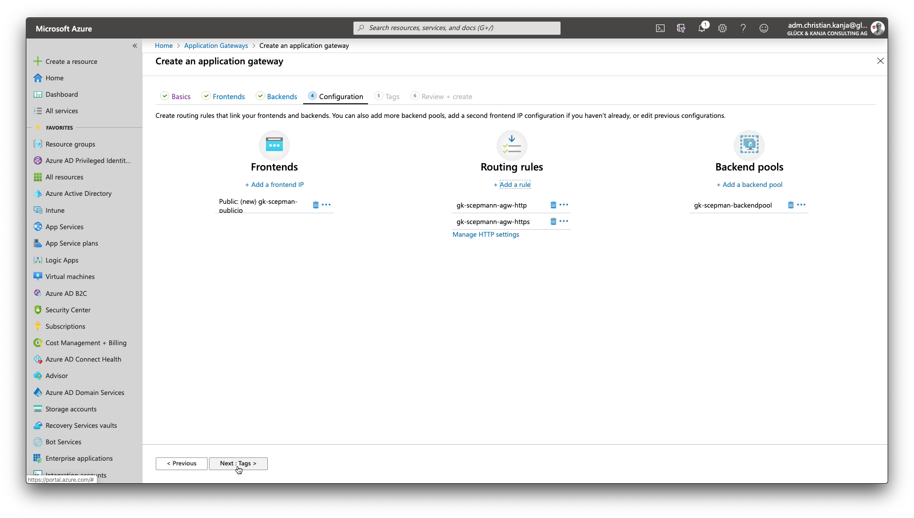

# Cisco ISE Host Header Limitation

Cisco ISE is still not supporting HTTP 1.1 when looking up OCSP and therefore can't connect to a general SCEPman instance running on Azure App Services. The error message may look like this:

Cisco is currently investigating future enhancements but for the time being you can use an [Azure Application Gateway](https://azure.microsoft.com/en-us/services/application-gateway/) to provide an instance of SCEPman not requiring a Host Header.

This documentation is a quick introduction to the basic steps required to create such an Application Gateway. Please forgive the rudimentary form.

Create an Azure Application Gateway for SCEPman

1\) Create a new Application Gateway

2\) Provide the necessary basic information

3\) Create a new static public IP address

4\) Create a new Backend Pool

5\) Add a routing rule for HTTP

5b\) Add a new HTTP Setting with Host Header \(your SCEPman public FQDN\)

6\) Add a routing rule for HTTPS


Important: This step requires an HTTPS web server certificate.


6b\) Add a new HTTPS Setting with Host Header \(your SCEPman public FQDN\)

7\) Confirm Routing Rules

8\) Finalize

