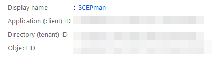
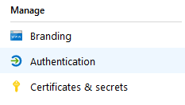
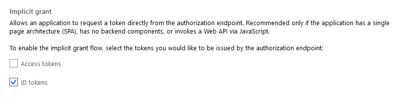
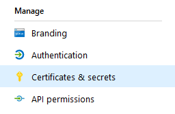
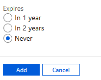
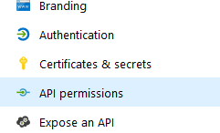
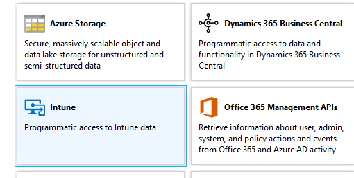
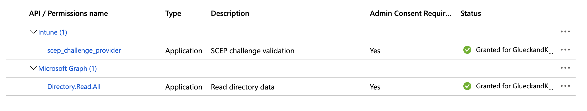
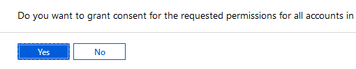

# Azure App Registration

## Azure App Registration

The first step is the registration of an application in Azure AD:

| Task | Image |
| :--- | :--- |
| 1. Login in to [Azure Portal](https://portal.azure.com) |  |
| 2. Navigate to **Azure Active Directory** |  |
| 3. Click **App registrations** |  |
| 4. Then, **New registration** |  |
| 5. Enter a **Name** \(e.g. SCEPman\) |  |
| 6. For **Supported account types** choose **Accounts in this organizational directory only** |  |
| 7. Then, click **Register** |  |
| 8. Save the **Application \(client\) ID**. The ID is important and will be needed later |  |

## Azure App Registration / Authentication

| Task | Image |
| :--- | :--- |
| 1. Click **Authentication** |  |
| 2. Scroll down to **Advanced settings** |  |
| 3. Select **ID tokens** |  |
| 4. Finally, click **Save** |  |

## Azure App Registration / Client Secret

| Task | Image |
| :--- | :--- |
| 1. Click **Certificates & secrets** |  |
| 2. Click **New client secret** |  |
| 3. Define a **Description** and select **Never** |  |
| 4. Finally, click **Add** |  |


Copy the client secret value. You will not be able to retrieve it after you leave this submenu


## Azure App Registration / API permissions

| Task | Image |
| :--- | :--- |
| 1. Still in the SCEPman Application, click **API permissions** |  |
| 2. Click **Add a permission** |  |
| 3. Then, click **Intune** |  |
| 4. Select **Application permissions** |  |
| 5. Click **scep\_challenge\_provider** |  |
| 6. Then, click **Add permissions** |  |
| 7. Next, click **Microsoft Graph** |  |
| 8. Scroll down to **Directory** and click it |  |
| 9. Select **Directory.Read.All** |  |
| 10. Then, click **Add permission** |  |
| 11. Click **Grant admin consent for...** and confirm the displayed dialog with **Yes** |  |
| 12. The Azure AD app registration is finished |  |

