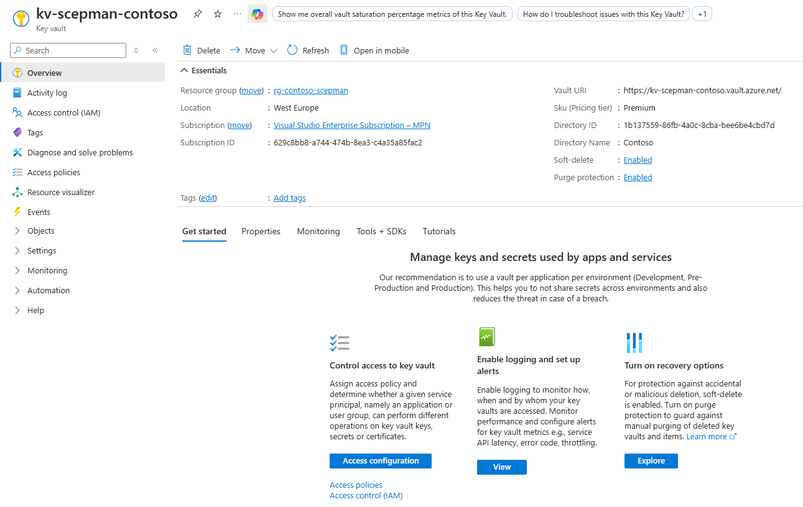

# Key Vault RBAC Migration

Microsoft is shifting Azure Key Vault toward Azure RBAC as the default access control model for all new Key Vaults starting with API version **2026‑02‑01**. Read more [here](https://learn.microsoft.com/en-us/azure/key-vault/general/access-control-default?tabs=azure-cli).&#x20;

While RBAC isn’t strictly mandatory and **existing Key Vaults using access policies can continue operating as is,** tenants that create a new Key Vault after upgrading to the new API will get RBAC by default unless access policies are explicitly configured.

It may be a good idea to migrate to RBAC regardless, as it provides a more unified and scalable permission model aligned with Microsoft Entra ID and future-proofs your setup in the event Microsoft deprecates Key Vault access policies.

## Migration Guide


Account for downtime before proceeding. SCEPman will be unable to issue or verify certificates until permissions have migrated successfully.




### Navigate to your SCEPman Key Vault

Navigate to Azure > Key Vaults > _Your SCEPman Key Vault_&#x20;

<figure><figcaption></figcaption></figure>



### Review your existing Access Policies

Navigate to **Access policies** and document your SCEPman's access policies under **Application**_._ The SCEPman access policies should share the same name as your SCEPman App Service (and any geo-redundant SCEPman App Services).&#x20;

_User_ access policies do not need to be migrated as they won't affect SCEPman functionality. Users that require continued access should have their access policies reviewed and migrated to Azure roles based on the following table: [https://learn.microsoft.com/en-us/azure/key-vault/general/rbac-migration?tabs=cli#access-policy-templates-to-azure-roles-mapping](https://learn.microsoft.com/en-us/azure/key-vault/general/rbac-migration?tabs=cli#access-policy-templates-to-azure-roles-mapping)

<figure><figcaption></figcaption></figure>



### Change the Permission Model

Change the Permission Model from **Vault access policy** to **Azure role-based access control**

<figure><figcaption></figcaption></figure>

Pressing **Apply** will disconnect your SCEPman instance from the Key Vault until Azure Roles are assigned. Previous access policies will also be removed.



### Assign Azure Roles

Navigate to Access control (IAM) and assign the following roles to the **managed identity** of your SCEPman App Service (and any geo-redundant SCEPman App Services):

* Key Vault Certificates Officer
* Key Vault Crypto Officer
* Key Vault Secrets User

<figure><figcaption></figcaption></figure>

Roles must be assigned one at a time, however multiple identities can be assigned to one role.

<figure><figcaption></figcaption></figure>

The Certificate Master's managed identity (with -cm in its name) **does not** require access to the Key Vault.



### Check Key Vault Connectivity

Restart your SCEPman App Service, then navigate to your SCEPman homepage and ensure your Key Vault is connected.

<figure><figcaption></figcaption></figure>



