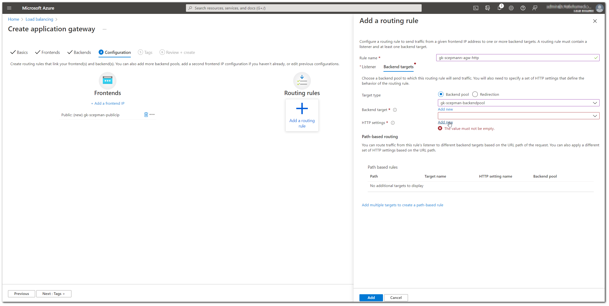
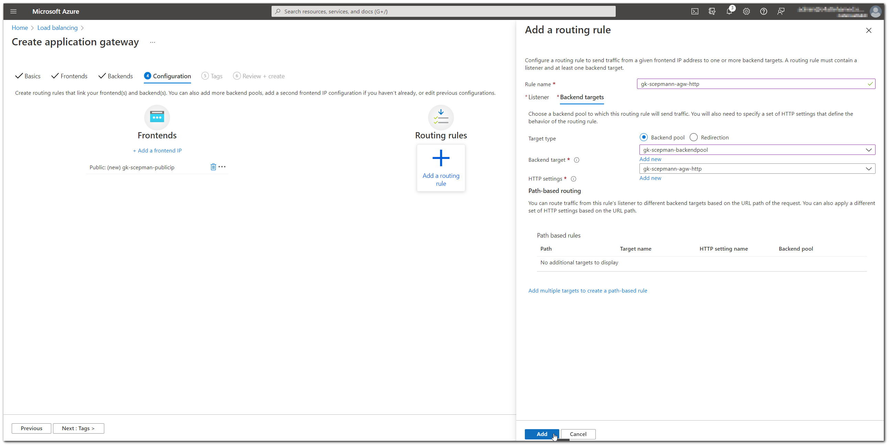
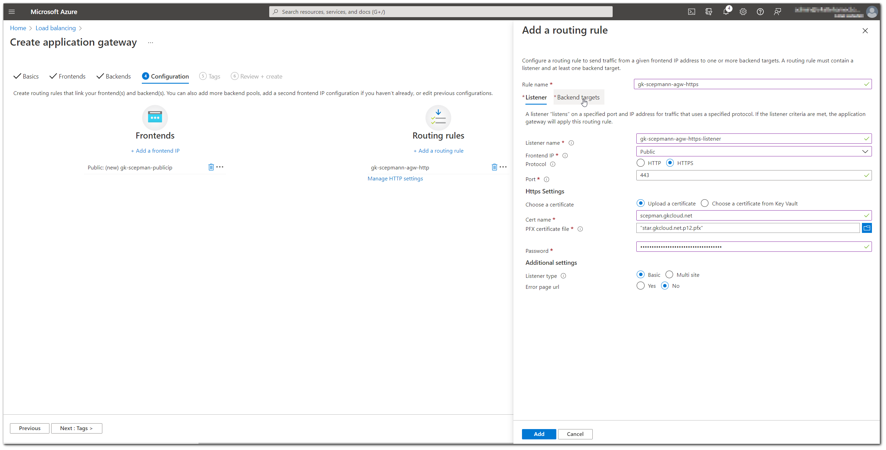
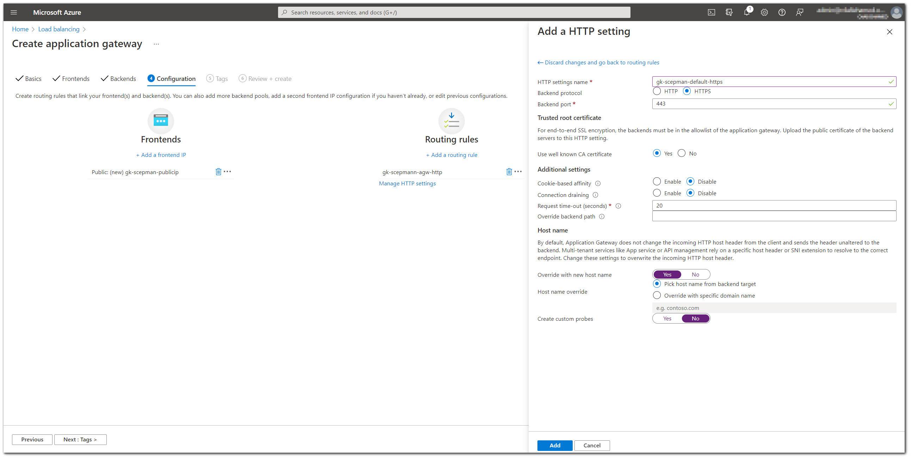
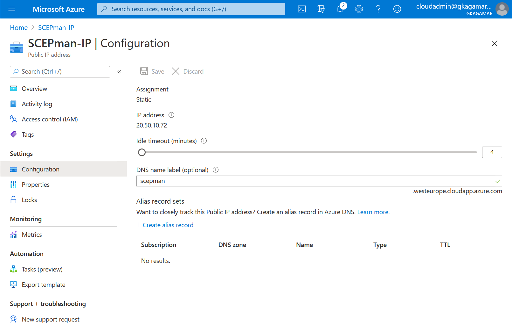

# Cisco ISE Host Header Limitation

Both Cisco ISE as well as Aruba ClearPass do not support HTTP 1.1 when looking up OCSP and do not send a host header in their OCSP request. Therefore, they cannot connect to a general SCEPman instance running on Azure App Services. The error message may look like this:

.jpg>)

Cisco is currently investigating future enhancements but for the time being you can use an [Azure Application Gateway](https://azure.microsoft.com/en-us/services/application-gateway/) to provide an instance of SCEPman not requiring a Host Header.

The following instructions outline the steps required to create an Azure Application Gateway for SCEPman:

## 1) Create a new Application Gateway

.png>)

## 2) Provide the necessary basic information

.png>)

## 3) Create a new static public IP address

.png>)

## 4) Create a new Backend Pool

.png>)

## 5) Add a routing rule for HTTP

.png>)

## 5b) Add a new HTTP Setting with Host Header (your SCEPman public FQDN)


Around the beginning of June, Microsoft introduced a bug in Azure Application Gateway that prevents adding a host header to host-header-free requests when "Pick host name from backend target" is selected. We recommended "Pick host name from backend target" in a previous version of this documentation, but this does no longer work. As a workaround, choose "Override with specific domain name" as depicted below and insert the name of your SCEPman App Service, e.g. _contoso-scepman.azurewebsites.net_.


.png>)

## 6) Optional: Add a routing rule for HTTPS


This step requires an HTTPS web server certificate.



The use of HTTP without TLS is not a security vulnerability; PKI-based resources are commonly published via HTTP without TLS, as the TLS handshake may require access to these resources. Using TLS would create a chicken-and-egg problem where the TLS handshake requires access to the PKI resources and access to the PKI resources requires a TLS handshake. Therefore, these PKI resources including the protocols SCEP and OCSP employ their own encryption and/or signatures where it is required.


.png>)

## 6b) Add a new HTTPS Setting with Host Header (your SCEPman public FQDN)

## 7) Confirm Routing Rules

.png>)

## 8) Finalize the Application Gateway configuration

.png>)

## 9) Configure the DNS name for the IP

Then, add a DNS name for the Gateway:

1. Open the IP Address resource
2. Add a name of your choice as DNS name label

1. Optional: You can add a CNAME entry for a DNS record that you own DNS servers.

## 10) Add the Application Gateway DNS name to SCEPman configuration

Eventually, configure the new name in the SCEPman settings:

1\. Go to the App Service for SCEPman and open the Configuration page in the Settings section.

2\. Edit the value AppConfig:BaseURL.

3\. Enter the DNS name for the IP address prefixed with "http://". If you have configured a TLS certificate in the Azure Application Gateway, you may also use HTTPS.

## Intune/JAMF configuration

In the Intune configuration, you may still use the App Service's URL instead of the Azure Application Gateway's. If you do this, the clients communicate directly with the App Service. You must configure the Azure Application Gateway's URL in Cisco ISE, as only this URL supports HTTP 1.0 requests.
