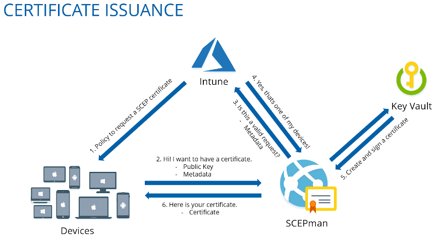
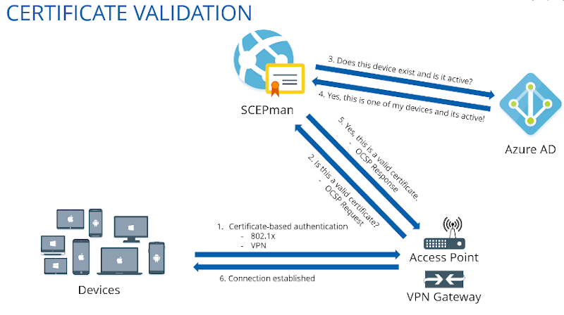

# Overview

## What is SCEP?

Usually when it is necessary to deploy certificates to (mobile) devices, [Simple Certificate Enrollment Protocol](https://www.rfc-editor.org/rfc/rfc8894.html) (SCEP) is the first choice. SCEP is an [Internet draft](https://en.wikipedia.org/wiki/Internet_Draft) standard protocol. An Internet draft contains technical specifications and information. Internet drafts are often published as a [Request for Comments](https://en.wikipedia.org/wiki/Request_for_Comments).

SCEP was originally developed by Cisco. Its purpose is to deploy certificates to network devices without any user interactions; devices can request certificates on their own.

## What is SCEPman?

A traditional SCEP deployment requires a number of on-premises components. Microsoft Intune and [other Mobile Device Management (MDM)](use-cases.md#mdm-solutions) solutions [allow third-party certificate authorities (CA](https://learn.microsoft.com/en-us/mem/intune/protect/certificate-authority-add-scep-overview)) to issue and validate certificates using SCEP.

We developed SCEPman to help organizations move from these on-premises infrastructure to a cloud-native solution running in Azure.


SCEPman issues certificates that are **intended for authentication and transport encryption**. That said, you can deploy user and device certificates used for network authentication, WiFi, VPN, RADIUS and similar services.

**You may** use SCEPman for transactional **digital signatures** i.e. for S/MIME signing in Microsoft Outlook. If you plan to use the certificates for message signing you need to add the corresponding extended key usages in the Intune profile configuration. Please keep in mind that SCEPman certificates are trusted in your organization only. SCEPman does not issue publicly trusted certificates.

**Do not** use SCEPman **for email-encryption** i.e. for S/MIME mail encryption in Microsoft Outlook (without a separate technology for key management). The nature of **the SCEP protocol does not include a mechanism to back up or archive private key material.** If you use SCEP for email encryption you may lose the keys to decrypt the messages at a later time.


### SCEPman Workflow

Here's an overview about the SCEPman workflow when using Intune as MDM solution (the flows are similar for other MDM solutions). The first figure shows the certificate issuance and the second figure shows the certificate validation.

#### Process of certificate issuance

#### Process of certificate validation during certificate-based authentication

### SCEPman Features

SCEPman is an Azure Web App with the following features:

* A SCEP interface that is compatible with the Intune [SCEP API](https://learn.microsoft.com/en-us/mem/intune/protect/certificate-authority-add-scep-overview).
* Broader MDM support: Jamf Pro, Iru (formerly Kandji), Mosyle, Addigy and more.
* An Active Directory endpoint handling SOAP requests, allowing for certificates to be pushed using Group Policies.
* SCEPman provides certificates signed by a CA root key stored in **Azure Key Vault**.
* SCEPman contains an **OCSP responder** (see below) to provide [certificate validity / auto-revocation](certificate-management/manage-certificates/#automatic-revocation) in real-time.
* Optional geo-redundancy, auto-scaling and able to handle anywhere from 50 to 100,000+ users.

SCEPman creates the CA root certificate during the initial installation. However, you can replace this CA key and certificate with your own in Azure Key Vault, for example, if you want to use a Sub CA certificate signed by an existing internal Root CA.

#### Certificate Master

Certificate Master allows [Enterprise Edition](editions/#edition-comparison) customers to (manually) issue certificates in scenarios where an automatic enrollment via SCEP / MDM is not possible. Common examples are the issuance of [TLS server certificates](certificate-management/certificate-master/tls-server-certificate-pkcs-12.md) or user certificates for [smart cards / YubiKeys](certificate-management/certificate-master/user-certificate.md). Furthermore, administrators can use Certificate Master to [manage](certificate-management/manage-certificates/) any certificate issued by SCEPman, whether it was automatically enrolled via SCEP (Intune, Jamf and other MDMs), EST, the [Enrollment REST API](certificate-management/api-certificates/) or manually via Certificate Master UI itself.


[certificate-master](certificate-management/certificate-master/)


### SCEPman OCSP (Online Certificate Status Protocol)

The [Online Certificate Status Protocol (OCSP)](https://en.wikipedia.org/wiki/Online_Certificate_Status_Protocol) is an Internet protocol which is used to determine the state of a certificate. An OCSP client sends a status request to an OCSP responder, which verifies the validity of a certificate based on revocation state or other mechanisms.&#x20;

In comparison to a Certificate Revocation List (CRL), which SCEPman supports as well, an OCSP response is always up-to-date, and the response is available within seconds. A CRL has the disadvantage that it is based on a database that must be refreshed manually and can grow quite large. Read a detailed comparison of these revocation mechanisms [on our company blog.](https://www.glueckkanja.com/blog/products/2023/05/certificate-revocation-en/)

## Getting Started

Please follow the steps on the following page to deploy SCEPman and automate certificate issuance for users, devices, and network authentication scenarios.
