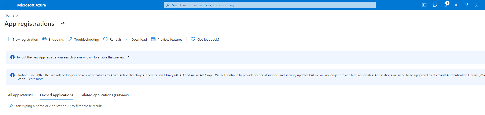
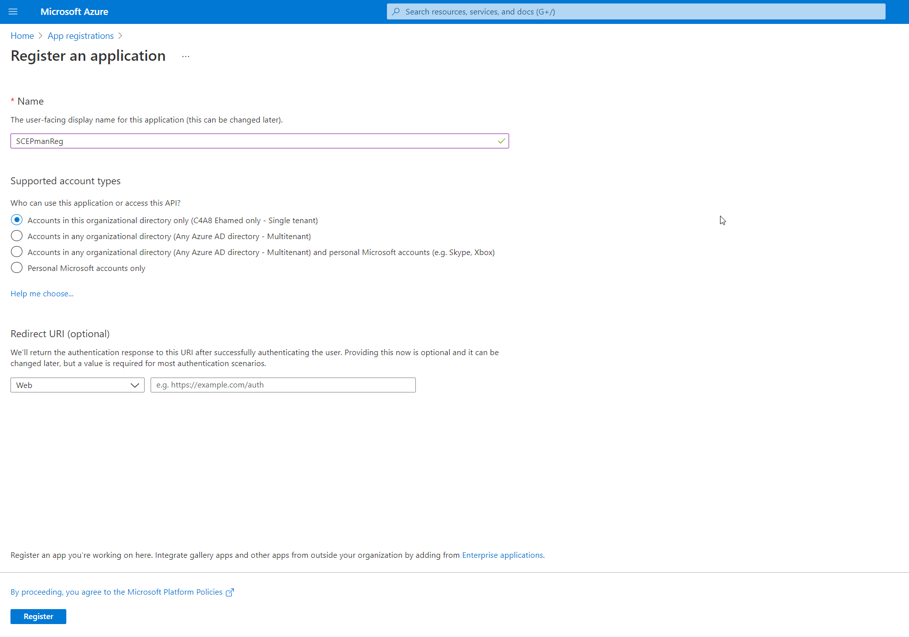
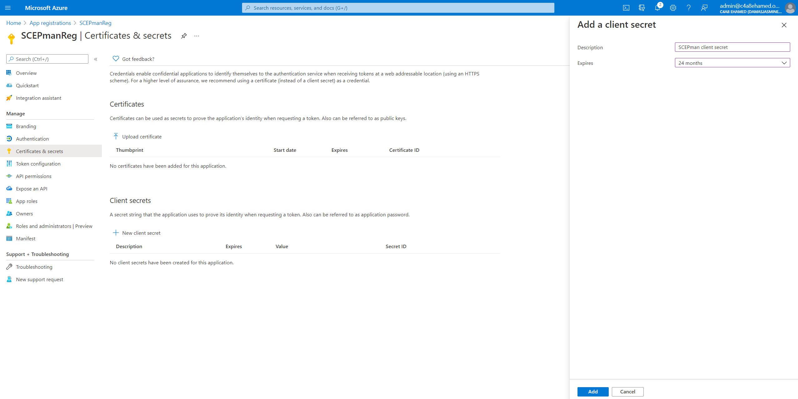
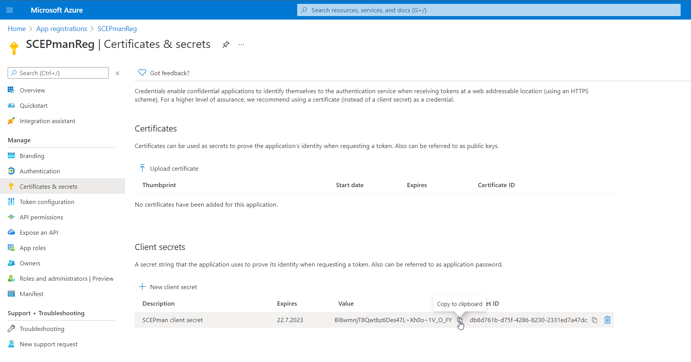

# Azure App Registration

SCEPman needs to interact with your Azure Active Directory and Intune endpoints to provide the certificate and OCSP validation of users and devices. To provide the necessary permissions to SCEPman you need to create an App Registration within your tenant.

## Basic App Registration

1. Login in to [Azure Portal](https://portal.azure.com)
2. Navigate to **Azure Active Directory**
3. Click **App registrations**

1. Click **New registration** and enter a **name**, i.e. SCEPman. For supported account types choose **Accounts in this organizational directory only** and click register.

1. You may copy the **Application \(client\) ID** now. The ID is important and will be needed later when installing SCEPman from marketplace. But you can access this ID anytime.

## Azure App Registration / Client Secret

1. Stay within **App registrations** and click on **Certificates & secrets**

1. Click **New client secret**, add a description and choose the expiration. We recommend **24 months**, this helps to provide an ongoing service for two years. You can revoke a secret at any time. Click **Add**.

1. **Copy the secret value** and write it down in a secure place.


Copy the client secret value. You will not be able to retrieve it after you leave this submenu


## Azure App Registration / API permissions

1. Stay within **App registrations** and click on **API permissions**


1. **Remove** the default **User Read** permission


1. Click on **Add a permission** and choose **Microsoft Graph**. When chosen, select **Application permissions** and search for directory. Add **Directory.ReadAll** as a permission.

1. Now click on **Add a permission** and choose **Intune**. When chosen, select **Application permissions** and search for scep. Add **scep\_challenge\_provider** as a permission.

1. Finally click on **Grant admin consent** and **confirm** the consent for the given app registration.

The app registration is done.

| [Back to Trial Guide](../scepman-deployment/trial-guide.md#step-1-azure-app-registration) | [Back to Community Guide](../scepman-deployment/community-guide.md#step-1-azure-app-registration) | [Back to Enterprise Guide](../scepman-deployment/enterprise-guide.md#step-1-azure-app-registration) |
| :--- | :--- | :--- |

