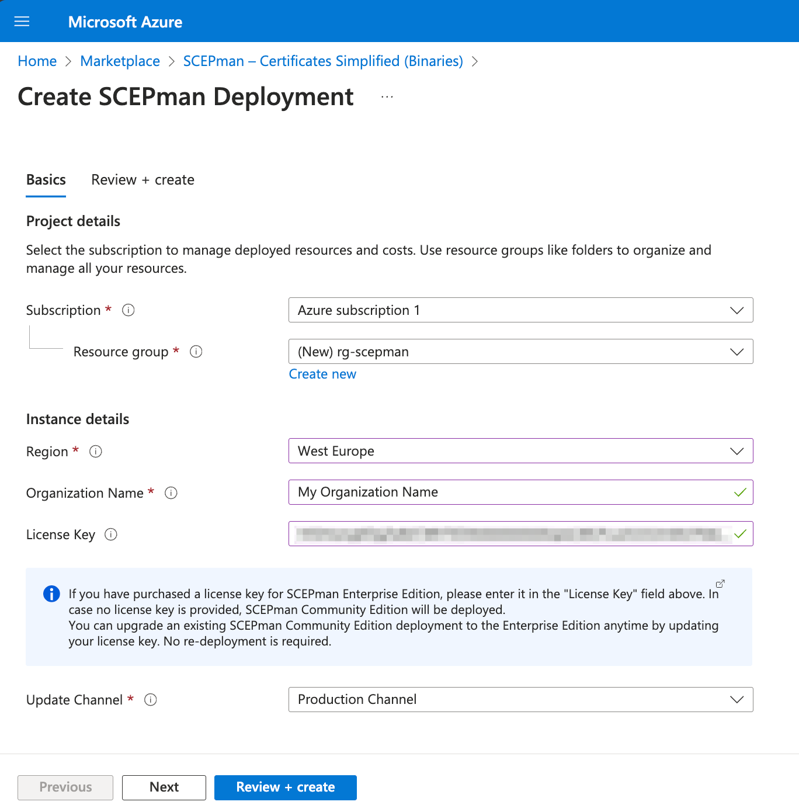

# Marketplace deployment

* To deploy SCEPman from Azure Marketplace, please visit this [**link**](https://azuremarketplace.microsoft.com/en-us/marketplace/apps/glueckkanja-gabag.scepman?tab=Overview).
* Click **Get it now** and afterwards **Continue**. You will be re-directed to the marketplace item on Azure Portal.

<figure><figcaption></figcaption></figure>

* Click **Create**.
* Now, follow these steps to deploy SCEPman in your Azure tenant:

<figure><figcaption></figcaption></figure>


If you have a license key, you can paste it into the field **License Key**. Leave it empty to use the free Community Edition of SCEPman.



To maximize compatibility, for the **Organization Name** we recommend to omit

* language-specific special characters (e.g. ö, ø, é, ...)
* a leading space (spaces between words can be used)
* quotation marks


1. Select an existing **resource group** or create a new one (SCEPman resources will be deployed in this group)
2. Set the **region** according to your preferred data center location. It **must** match the region of the resource group - in case you have selected an existing one. It will be assigned to the resource group otherwise.
3. Set an **Organization Name**. This field is **important** as the organization provided here will manifest itself in the O= field of the Root CA that is going to be created later on.
4. Select your preferred **Update Channel**. By default, the [Evergreen approach](../../update-strategy.md#evergreen-approach) is configured as [update strategy](../../update-strategy.md). This parameter determines from which [channel](../application-artifacts.md) the binaries for SCEPman will be loaded. For production environments, we recommend to use the **Production Channel** (default).
5. Click **Review + Create**.
6. Click **Create**.

Congratulations! The deployment of SCEPman is done. Please continue with the [next step](../../scepman-deployment/community-guide.md#step-2-perform-post-deployment-steps-permission-assignments) of the [Standard Guide](../../scepman-deployment/community-guide.md) to complete the installation of SCEPman.
