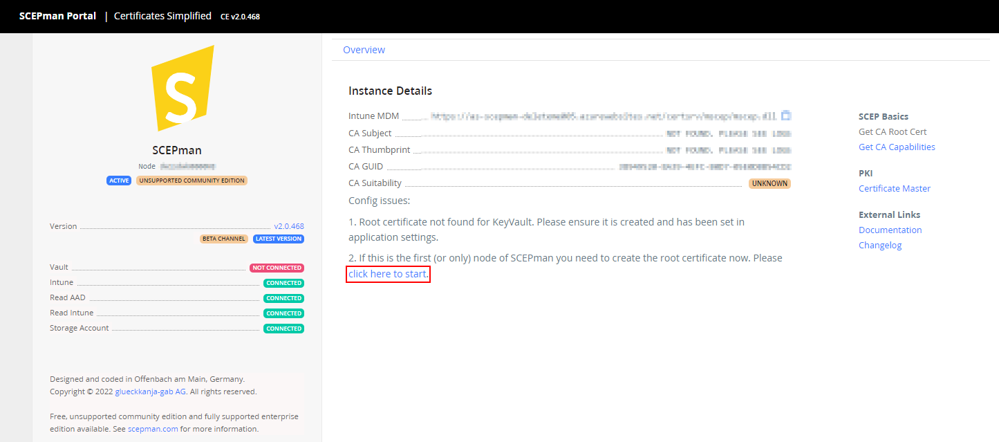
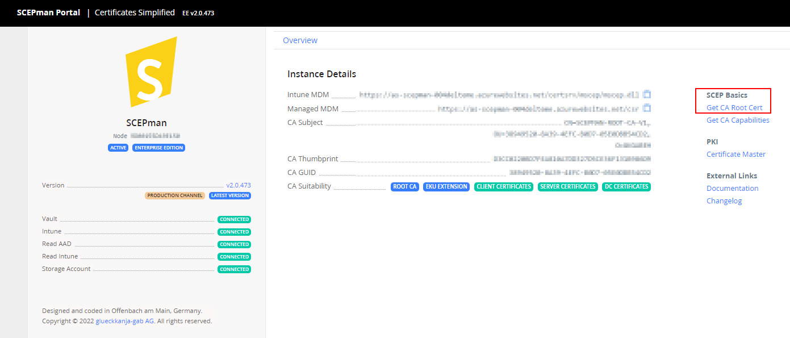

# Root Certificate

After you have deployed your SCEPman environment you have to create a root certificate.

If you want to use an intermediate certificate (Enterprise Edition only) you can have a look at this guide:&#x20;


[intermediate-certificate.md](optional/intermediate-certificate.md)


**For a standard SCEPman setup we recommend generating a new root certificate with the following steps:**

## Create SCEPman root certificate

1. Navigate to **App Services**.&#x20;
2. Choose the SCEPman application and click on **Browse** to see the SCEPman website.&#x20;
3. When everything works as intended **Intune**, **Read AAD, Read Intune,** and **Storage Account** are set in green as **connected**.

4\. The option **click here to start** creating the Azure Key Vault RootCA certificate. The initial root certificate should be created only once on a farm.\
5\. Select **I have read the documentation\[...]** and click **Create First Node**.\
6\. After some seconds/minutes you can refresh the page. Now you should see that the root certificate is available.

Now you are ready to start! Check [Certificate Deployment via Microsoft Intune](../certificate-deployment/microsoft-intune/)

| [Back to Trial Guide](../scepman-deployment/trial-guide.md#step-3-create-root-certificate) | [Back to Community Guide](../scepman-deployment/community-guide.md#step-3-create-root-certificate) | ​[Back to Enterprise Guide​](../scepman-deployment/enterprise-guide.md#step-3-create-root-certificate) |
| ------------------------------------------------------------------------------------------ | -------------------------------------------------------------------------------------------------- | ------------------------------------------------------------------------------------------------------ |
