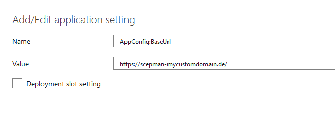

# Custom Domain

## Custom Domain Configuration

If you want to create your own custom domain for your **App Service** URL, follow these steps:

1. Choose your **App Service,** on the left select **Custom domain**. 
2. Click **Add custom domain.** 
3. Enter your custom domain \(**1**\) and click **Validate**. 
4. If **CNAME** is set correct \(**2**\) domain ownership is validated \(**3**\).

1. Click **Add custom domain** to finish this configuration.
2. When the domain is added, create a SSL binding.
3. Click **Add binding** on the custom domain screen.

1. On the TLS/SSL Binding submenu click **Upload PFX Certificate.**
2. After uploading select your certificate and the binding type.
3. Next click **Add binding.**

1. After completing these steps, **Application settings** needs to be updated
2. Choose app service and click **Configuration**
3. Then click **Application Settings** and edit the setting **AppConfig:BaseUrl**
4. Enter your custom domain and click **OK**.

1. Finally click **Save**.

### Microsoft Documentation and Managed Certificates

Add custom domain to an App Service:  
[https://docs.microsoft.com/en-us/azure/app-service/app-service-web-tutorial-custom-domain](https://docs.microsoft.com/en-us/azure/app-service/app-service-web-tutorial-custom-domain)

Add and manage TLS/SSL certificates in App Service:  
[https://docs.microsoft.com/en-us/azure/app-service/configure-ssl-certificate](https://docs.microsoft.com/en-us/azure/app-service/configure-ssl-certificate)

Create a free certificate:  
[https://docs.microsoft.com/en-us/azure/app-service/configure-ssl-certificate\#create-a-free-certificate-preview](https://docs.microsoft.com/en-us/azure/app-service/configure-ssl-certificate#create-a-free-certificate-preview)

| Back to Trial Guide | [Back to Community Guide](../../scepman-deployment/community-guide.md#step-4-configure-a-custom-domain-and-ssl-certificate) | ​[Back to Enterprise Guide​](../../scepman-deployment/enterprise-guide.md#step-4-configure-a-custom-domain-and-ssl-certificate) |
| :--- | :--- | :--- |

