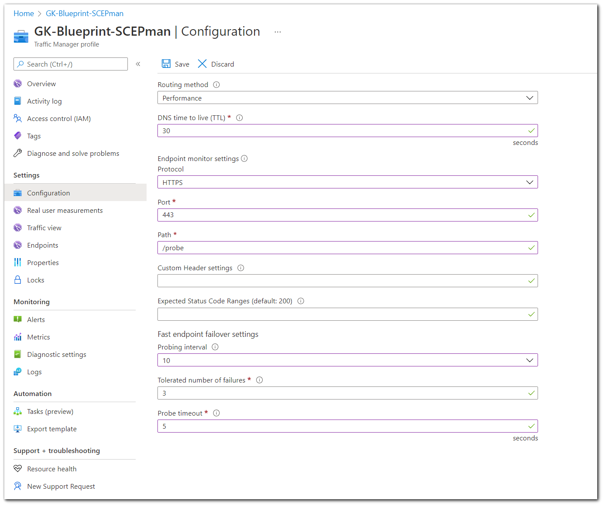

# Geo-redundancy


SCEPman Enterprise Edition only


## Geo-redundant Deployment (optional)

This section describes a high availability architecture for production use.

 (7) (7) (1) (1) (1) (2) (1) (6).png>)

## Clone App

After a successful deployment of SCEPman, Set up a custom domain for this SCEPman instance as described [here](custom-domain.md).

Now you can set up a load balancer for higher availability. Start cloning the app:

* Navigate to **App Service.**&#x20;
* Scroll down to **Development Tools** and click **Clone App.**&#x20;
* Fill in the required fields as follows:

1. **App name:** name for the cloned instance
2. **Resource Group:** create a new Resource Group for the cloned instance of SCEPman
3. **App Service plan/Location:**&#x20;

4\. Click **App Service plan/Location**

1. Then click **Create new** to create a new service plan.
2. Enter an **App Service plan** and select a **Location** (different from the first app location) and a **Pricing tier.**

 (7) (1) (1) (1) (2) (1) (6).png>)

5\. Click **OK**\
****6. Do not change the **Clone Settings**\
****7. Finally click **Create**

Next, you need a managed identity for the cloned app:\
\
1\. Go to your cloned web app and click on **Identity**

 (2) (2) (2) (2) (2) (2) (2) (2) (2) (2) (2) (2) (2) (2) (2) (1) (1) (1) (1) (2) (1) (6).png>)

2\. Under System assigned to switch the **Status** to **On**

 (2) (2) (2) (2) (2) (2) (2) (2) (2) (2) (2) (2) (2) (2) (3) (1) (1) (1) (1) (2) (1) (6).png>)

3\. Click **Save**\
****4. This will register your web app into Azure AD

Your **Identity** should look like this:

 (2) (2) (2) (2) (2) (2) (2) (2) (2) (2) (2) (2) (2) (2) (4) (1) (1) (1) (2) (1) (6).png>)


Cloning an app service has some restrictions such as **auto scale** settings, **backup schedule** settings, **app Insights**, etc.. so you have to configure them again (if needed) for the new cloned app service. For more info visit [https://docs.microsoft.com/en-us/azure/app-service/app-service-web-app-cloning#current-restrictions](https://docs.microsoft.com/en-us/azure/app-service/app-service-web-app-cloning#current-restrictions)


## Setup Azure Key Vault Access Policy

1\. Go to your **Key Vault**\
****2. open your first SCEPman **KeyVault**\
****3. Click on **Access policies** under **Settings, Add new**

 (7) (7) (7) (4) (1) (1) (1) (2) (1) (6).png>)

4\. Then click on **Add Access policy,** to add permissions to your new cloned SCEPman instance.

5\. Now add for **Key, Secret and Certificate permissions** all permissions except the **Privileged Certificate Operations** "**Purge"** leave it unchecked, your access policy should look like this:

 (7) (7) (7) (6) (1) (1) (1) (2) (1) (6).png>)

6\. now **Select principal**: select the **new cloned** instance of SCEPman, **Add** and **Save**

 (7) (7) (7) (5) (1) (1) (1) (2) (1) (6).png>)

## Setup Traffic Manager

1. Search **Traffic Manager profile** and click **Create.**&#x20;
2. Fill in the fields.

 (2) (2) (2) (2) (2) (2) (2) (2) (2) (2) (2) (2) (2) (2) (6) (7) (5) (1) (1) (1) (2) (1) (6).png>)

1. Then click **Create**.
2. After your Traffic Manager is deployed, go to it and click **Configuration** under settings.
3. Change the settings as follows:

1. Save changes.
2. Then under **Settings** choose **Endpoints**
3. Click **Add** and choose the primary web service.

.png>)

Repeat these steps for your second web service.

In the **Overview** your Traffic Manager should like this (here you find the Traffic Manager URL):

 (1) (1) (2) (1) (6).png>)

* Navigate to your **AppService** for the cloned SCEPman instance
* Under **Custom Domains**, repeat the SSL certificate binding process as described [here](https://docs.scepman.com/scepman-configuration/optional/custom-domain#SSL-Binding)
* Both instances of SCEPman must have the same custom domain
* Navigate to your DNS management service (e.g. **Azure DNS Zones**)
* There shall be a CNAME entry for the custom SCEPman domain that maps to the Traffic Manager endpoint. This entry may exist already if you are using Azure DNS and Traffic Manager created the entry for you. If it does not exist, remove any possibly existing wrong CNAME entry and add a CNAME that maps the custom SCEPman domain to the Traffic Manager endpoint now.


In **Azure DNS Zone**, in order to modify a record, you first have to remove the DNS lock by navigating to **Locks**.


| Back to Trial Guide | Back to Community Guide | ​[Back to Enterprise Guide​](broken-reference) |
| ------------------- | ----------------------- | ---------------------------------------------- |
