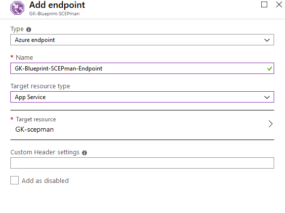

# Geo-redundancy


SCEPman Enterprise Edition only


## Geo-redundant Deployment \(optional\)

This section describes a high availability architecture for production use.

## Clone App

After successful deployment of SCEPman, you can set up a load balancer for higher availability. Start cloning the app:

1. Navigate to **App Service.** 
2. Scroll down to **Development Tools** and click **Clone App.** 
3. Fill in the required fields.

1. Click **App Service plan/Location.**

1. Then click **Create new** to create a new service plan.
2. Enter a **App Service plan** and select a **Location** and a **Pricing tier.**

1. Click **OK.**
2. Do not configure the **Clone Settings**.
3. Finally click **Create**.

Next, you need a managed identity for the cloned app:

1. Go to your cloned web app and click **Identity.**

1. Under System assigned switch the **Status** to **On.**

1. Click **Save.**
2. This will register your web app into Azure AD.

Your **Identity** should look like this:

## Setup Azure Key Vault Access Policy

1. Go to your Key Vault. 
2. Click **Access policies** and then click **Add new.**

1. In the submenu **Add access policy** click **Select principial**.

1. Search your web app identity.
2. Now select **Key permissions, Secret permissions** and **Certificate permissions**.
3. Your access policy should look like this:

1. Then click **Add**.
2. Finally click **Save**.

## Setup Traffic Manager

1. In Microsoft Azure click **Create a resource**. 
2. Search **Traffic Manager profile** and click **Create.** 
3. Fill in the fields.

1. Then click **Create**.
2. After your Traffic Manager is deployed, go to it and click **Configuration**.
3. Change the settings.

1. Then under **Settings** choose **Endpoints**
2. Click **Add** and choose the primary web app.

1. Repeat these steps for your second web app.  

In the **Overview** your traffic manager should like this \(here you find the traffic manage URL\):

## Own Application Setup \(optional\)

The SCEPman application will be loaded from the zip file which is located in a Glück & Kanja [Github repository](https://github.com/scepman/install/raw/master/dist/Artifacts.zip). This zip file will be updated automatically from the Glück & Kanja development team. If a customer does not want to get auto-updates, the web apps can load the zip file from the self-managed storage account.

1. In Microsoft Azure click **Create a resource**. 
2. Search for **Storage account** and click **Create**. 
3. Configure your storage account like this:

1. Click **Create.**
2. Go to your Storage account and chose **Blobs.**

1. Then click **+Customer.**
2. Enter a **Name.**
3. As **Public access level** select **Blob \(anonymous read access for blobs only\).**

1. Click **OK.**
2. Select your Container and click **Upload**.
3. Choose the **Artifacts.zip**

1. Then click **Upload.**
2. Next click on the zip-file.
3. Click **Properties** and copy the **Uri** value.
4. Then navigate to your primary web app in **App Services**
5. Click **Configuration**

1. In **Application settings** search **WEBSITE\_RUN\_FROM\_PACKAGE**

| Back to Trial Guide | Back to Community Guide | ​[Back to Enterprise Guide​](../../getting-started/enterprise-guide.md#step-10-configure-geo-redundancy-optional) |
| :--- | :--- | :--- |

