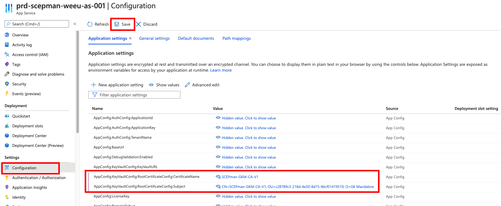

# Intermediate certificate


SCEPman Enterprise Edition only


If you want to use another Root CA as primary authority, you can create an intermediate certificate. You can create the correct certificate direct in Azure Key Vault and download the CSR for signing with your Root CA. The signed request can be uploaded and merged into the Azure Key Vault.

## Creating Intermediate Certificate via API

You must create the certificate via the Key Vault API. This is because not all flags and features are available via UI and PowerShell. You can use Postman to work with the API.

For requests against an Azure Key Vault we need a valid authorization token. We can use the Azure AD App that is registered for SCEPman. \([Azure App Registration](../azure-app-registration.md)\)

You need the following information:

| Key | Value |
| :--- | :--- |
| {TenantID} | &lt;GUID&gt; of your Azure AD Tenant |
| {YourApplicationID} | &lt;GUID&gt; -&gt; the **Application \(Client\) ID** of your Azure App Registration |
| {YourApplicationKey} | Client secret from you Azure App Registration |
| {YourKeyVaultName} | Name of your Azure Key Vault ressource |
| {NewCertName} | Name of your new Intermediate certificate. Now spaces allowed! |
| {CompanyName} | Acronym of your Company. No spaces allowed! |

### Key Vault Access Policy

We need to allow the Azure AD App and your user account to access the Azure Key Vault.

1. Navigate to your Azure Key Vault in the Azure Portal
2. Click on **Access policies** in the left navigation pane.
3. Click on **Add Access Policy** 


1. Click **Configure from template \(optional\)** and choose **Key, Secret & Certificate Management**  
2. **\*\*Click on** Key permissions **and select all** Cryptographic Operations\*\*   
3. Now you must select a principal by clicking on **None selected** and search for you Azure AD App   

     registration.  

4. To close the dialog press **Select** and then press **Add**


1. In the picture above you can see the new entry for the Azure AD App.  
2. Repeat Step 3 to 7 but now select your current user account.  
3. To save your new access policies you must click on **Save** in the upper left corner of the window.


After we saved this access policies successfully, we can continue with the API calls.

### Authenticate against Microsoft to retrieve a Token

To get an authorization token we must send a POST request against the Microsoft OAuth endpoint. This will return a Bearer token.

You can use the following POST request and Body and must change all **{}** parts. If you want to use cURL or Postman, you can download a text file with the complete cURL stement. Remeber that you have to change all **{}** parts.

```text
POST https://login.microsoftonline.com/{TenantID}/oauth2/v2.0/token
```

Body:

```text
grant_type:client_credentials
client_id:{YourApplicationID}
client_secret:{YourApplicationKey}
scope:https://vault.azure.net/.default
```



Copy the **access\_token** from the answer and use this in the next request.

### Send new cert request to KeyVault API

After we received the Bearer token from the OAuth endpoint**,** we can continue with the **create** request again the Azure Key Vault.

You can use the following POST request and Body and must change all **{}** parts. If you want to use cURL or Postman, you can download a text file with the complete cURL statement. Remember that you must change all **{}** parts.

You can also change the certificate validity to a value of your choice. The format of the subject is only a suggestion from our side, you can choose your favorite subject.

```text
POST https://{YourKeyVaultName}.vault.azure.net/certificates/{NewCertName}/create?api-version=7.1
```

Body:

```text
{
  "policy": {
    "key_props": {
      "exportable": true,
      "kty": "RSA",
      "key_size": 2048,
      "reuse_key": false
    },
    "secret_props": {
      "contentType": "application/x-pkcs12"
    },
    "x509_props": {
      "subject": "CN={NewCertName}, OU={TenantID}, O={CompanyName}",
      "ekus": [],
        "key_usage": [
                "cRLSign",
                "digitalSignature",
                "keyCertSign",
                "keyEncipherment"
            ],
            "validity_months": 120,
            "basic_constraints": {
                "ca": true
            }
    },
    "lifetime_actions": [
            {
                "trigger": {
                    "lifetime_percentage": 80
                },
                "action": {
                    "action_type": "EmailContacts"
                }
            }
        ],
    "issuer": {
            "name": "Unknown",
            "cert_transparency": false
        }
  }
}
```



### download and sign

1. After you have sent the API calls you can see your new certificate in you Azure Key Vault.


1. To download the CSR and merge the signed request \(.cer\) you need to click on your certificate and press **Certificate Operation**  
2. **\*\*Now you can see the options** Download CSR **and** Merge Signed Request\*\*


1. After you have uploaded the signed request you can see the valid certificate in your Azure Key Vault in the area **Completed**

### Update Azure App Service Settings

The last step is to update the Azure App Service which runs the SCEPman with the new certificate information.

1. Navigate to you Azure App Service
2. Click on **Configuration** in the left navigation pane
3. In **Application settings** you must edit the following settings:

AppConfig:KeyVaultConfig:RootCertificateConfig:CertificateName AppConfig:KeyVaultConfig:RootCertificateConfig:Subject

1. As value you must insert your new certificate name and the new subject name.  
2. To complete this step, you must click on **Save** in the upper left part.



Please reboot the Azure App Service and then navigate to your SCEPman URL. On the SCEPman Status page you can see the new configuration and download the new intermediate certificate to deploy this via Endpoint Manager.

| Back to Trial Guide | Back to Community Guide | ​[Back to Enterprise Guide​](../../getting-started/enterprise-guide.md#step-6-configure-log-collection) |
| :--- | :--- | :--- |


