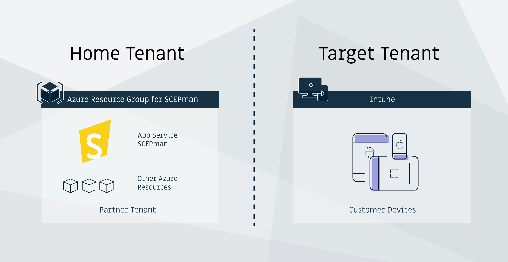
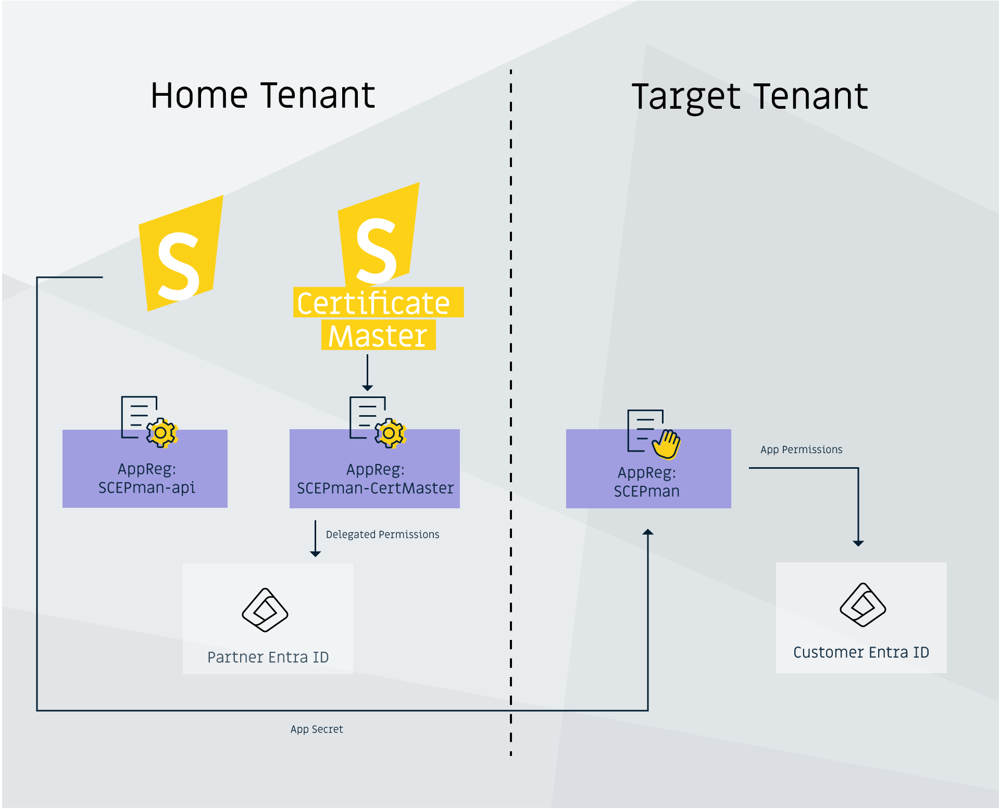
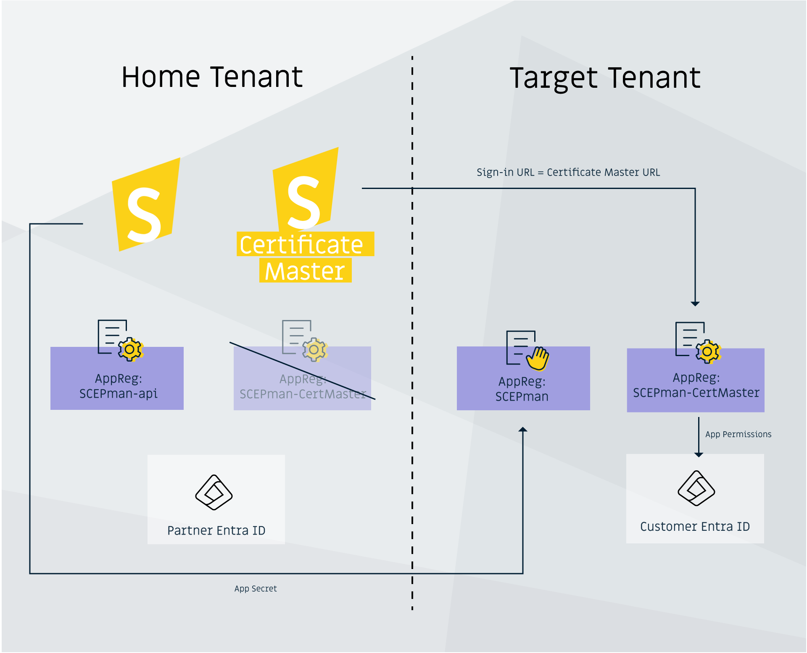
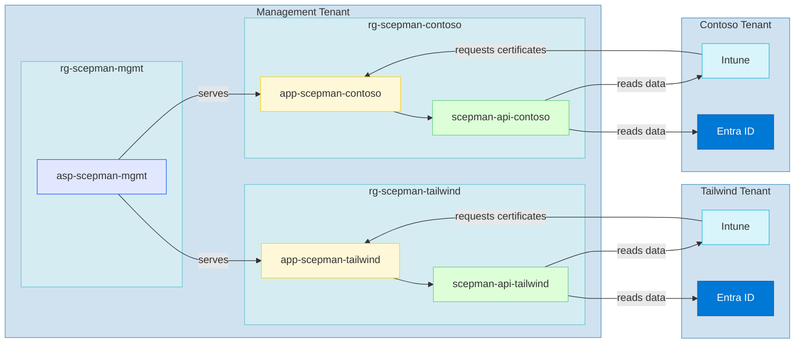

# Split-Tenancy


SCEPman Enterprise Edition only


## Overview <a href="#overview" id="overview"></a>

SCEPman can be set up to function from an Azure tenant separate from the Azure/Intune tenant for which it issues certificates to users and/or devices. This configuration, known as split-tenancy, is especially **helpful for MSPs** that would like to consolidate Azure infrastructure costs across their customers while maintaining a dedicated backend and unique CA for each of those customers.

Split-tenancy comes along with a **major disadvantage**: [Managed Identities](../post-installation-config.md) can no longer be used. This means authentication against the Graph API (Azure AD and Intune) is handled using an App registration and Client secret, which has to be managed (by the MSP) as it expires.

In the following, we refer to the hosting tenant as **home tenant,** while to the customer tenant as **target tenant**. SCEPman resources will exist in the **home tenant**, and the managed devices in the **target tenant** as in the graphic below:

<figure><figcaption></figcaption></figure>

## Configuration Steps

1. In the **home tenant**, perform a standard deployment of SCEPman/Certificate Master as described in our [Getting Started Guide](../../scepman-deployment/deployment-guides/).

### In SCEPman (Home Tenant)

2. Navigate to the SCEPman **App service** and then to "Settings" --> "Environment variables". Locate the following parameters and **delete** them:

| Environment Variables                                           |
| --------------------------------------------------------------- |
| `AppConfig:AuthConfig:ManagedIdentityEnabledForWebsiteHostname` |
| `AppConfig:AuthConfig:ManagedIdentityEnabledOnUnixTime`         |
| `AppConfig:AuthConfig:ManagedIdentityPermissionLevel`           |

3. **Rename** the following settings (**do not change their values**):

<table><thead><tr><th width="384">Original name</th><th>New name</th></tr></thead><tbody><tr><td><code>AppConfig:AuthConfig:ApplicationId</code></td><td><code>AppConfig:AuthConfig:HomeApplicationId</code></td></tr><tr><td><code>AppConfig:AuthConfig:TenantId</code></td><td><code>AppConfig:AuthConfig:HomeTenantId</code></td></tr></tbody></table>

4. Create an **App registration** in the **target tenant** as described here: [Azure App Registration](../../scepman-deployment/permissions/azure-app-registration.md). This **App registration** will allow SCEPman to access the Azure AD and Intune directories in the **target tenant**.


The **client secret** generated as part of this **App registration** has an expiration and must be renewed before it expires. Please set a reminder for the renewal.


**Create** the following new environment variables if you haven't done that already during creation of the app registration:

<table><thead><tr><th width="395">Name</th><th>Value</th></tr></thead><tbody><tr><td><code>AppConfig:AuthConfig:ApplicationId</code></td><td>GUID of the <strong>App registration</strong> that was created before <strong>(target tenant).</strong></td></tr><tr><td><code>AppConfig:AuthConfig:TenantId</code></td><td>Tenant ID of the <strong>target tenant</strong>.</td></tr><tr><td><code>AppConfig:AuthConfig:ApplicationKey</code></td><td><strong>Value</strong> of the <strong>Client secret</strong> that was created as part of the <strong>App registration</strong> in the <strong>target tenant</strong>.</td></tr></tbody></table>

5. Apply the changes.
6. Restart the SCEPman **App service**.

### Certificate Master

7. Navigate to the Certificate Master **App service** and then to "Settings" > "Environment variables".
8. Now you have two options:
   1. If you want users from your **home tenant** to log in to Certificate Master and issue certificates, which includes guest users in your home tenant, e.g. from your target tenant.&#x20;

<figure><figcaption><p>Option 1: Users from Home Tenant log in to Certificate Master</p></figcaption></figure>

If that is the case, **rename** the following settings (**do not change their values**):

<table><thead><tr><th width="385">Original name</th><th>New name</th></tr></thead><tbody><tr><td><code>AppConfig:AuthConfig:TenantId</code></td><td><code>AppConfig:AuthConfig:HomeTenantId</code></td></tr><tr><td><code>AppConfig:AuthConfig:ApplicationId</code></td><td><code>AppConfig:AuthConfig:HomeApplicationId</code></td></tr></tbody></table>

b. You want users from your **target tenant** to log in to Certificate Master and issue certificates, which includes guest users in your target tenant, e.g. from your home tenant.&#x20;

<figure><figcaption><p>Option 2: Users from the Target Tenant log in to Certificate Master</p></figcaption></figure>

If that is the case, do the following:

* Open a **PowerShell** or **Azure Cloud Shell** in your **target tenant** and run the following commands:

```
Install-Module SCEPman -Scope CurrentUser -Force
Register-SCEPmanCertMaster -CertMasterBaseURL <url>
```

Replace `<url>` with your Certificate Master URL

* The **CMDlet** will output an **Application Id** and a **Tenant Id** (that of the **target tenant**). Enter these two values as&#x20;
  * `AppConfig:AuthConfig:HomeApplicationId` and
  * `AppConfig:AuthConfig:HomeTenantId` in your Certificate Master settings.
* Now **create** the following new application settings, possibly overriding the existing ones, with the same values as in SCEPman:

<table><thead><tr><th width="393">Name</th><th>Value</th></tr></thead><tbody><tr><td><code>AppConfig:AuthConfig:ApplicationId</code></td><td>GUID of the <strong>App registration</strong> that was created before.</td></tr><tr><td><code>AppConfig:AuthConfig:TenantId</code></td><td>Tenant ID of the <strong>target tenant</strong>.</td></tr><tr><td><code>AppConfig:AuthConfig:ApplicationKey</code></td><td><strong>Value</strong> of the <strong>Client secret</strong> that was created as part of the <strong>App registration</strong> before.<br>You can create a separate new Client secret for Certificate Master if you want.</td></tr></tbody></table>

9. Save the changes
10. Restart the SCEPman Certificate Master **App service**.
11. Grant the rights to request certificates via the **Certificate Master** web app, see [here](../post-installation-config.md#granting-the-rights-to-request-certificates-via-the-certificate-master-website)

As an overview, here are the accounts used by **Certificate Master** and what they are used for:

| Account                                               | What is it used for?                                                                                                                                                               | Notes                                                                     |
| ----------------------------------------------------- | ---------------------------------------------------------------------------------------------------------------------------------------------------------------------------------- | ------------------------------------------------------------------------- |
| Managed Identity                                      | <ul><li>Authorize CSRs submitted to SCEPman</li><li>Access to the Storage Account</li></ul>                                                                                        | N/A                                                                       |
| App Registration with App ID from `ApplicationId`     | Certificate Master accesses Microsoft Graph in this context to see which certificates have been enrolled via Intune                                                                | If `ApplicationKey` is not present, the Managed Identity is used instead. |
| App Registration with App ID from `HomeApplicationId` | Users authenticate **to** this application. It should be in the tenant where users accessing Certificate Master reside (but guest users from other tenants can also be authorized) | If `HomeApplicationId` is not present, `ApplicationId` is used instead.   |

Now the Split-Tenancy configuration is finished, you can go ahead and configure your SCEP profiles based on your MDM, see [here](https://docs.scepman.com/advanced-configuration/split-tenancy)


## Considerations when having multiple target tenants

If you want to have multiple SCEPman instances to issue certificates to different target tenants you will want to take additional configuration steps to isolate these instances from each other.

A possible concept could include a management resource group that holds a single App Service Plan that will provide the computing resource for all of your SCEPman App Services. The following points should be taken into consideration when doing this for multiple tenants:

* Each instance should have its own resource group to distinguish them
* You should create App Registrations for each instance to isolate the permissions
* The App Service Plan should be created in an independent management resource group as it is serving multiple instances

In this diagram a management  tenant and its two SCEPman instances provide certificates to the tenants of Contoso and Tailwind:



### Add a new SCEPman instance to an existing App Service Plan

While deploying a new SCEPman instance using the [enterprise deployment method](https://docs.scepman.com/scepman-deployment/deployment-options/enterprise-deployment) you are offered the possibility to enter the resource id of an existing App Service Plan that this instance should be added to.

<figure><figcaption></figcaption></figure>

This resource id can be found in the properties of the existing app service plan:

<figure><figcaption></figcaption></figure>

### Create customer specific App registrations

To isolate the apps permissions you will need to adjust the post deployment command to specify custom App Registrations:


```powershell
Complete-SCEPmanInstallation -SCEPmanAppServiceName "app-scepman-contoso" -AzureADAppNameForSCEPman "scepman-api-contoso" -AzureADAppNameForCertMaster "certmaster-contoso" -SearchAllSubscriptions 6>&1
```


This command will result in a fully configured SCEPman instance that is isolated from the prior instances. You can now go on to configure the split tenancy for this instance.


The above section regarding the Certificate Master can now be applied optionally if you want this service to be accessible from the customer tenant.
