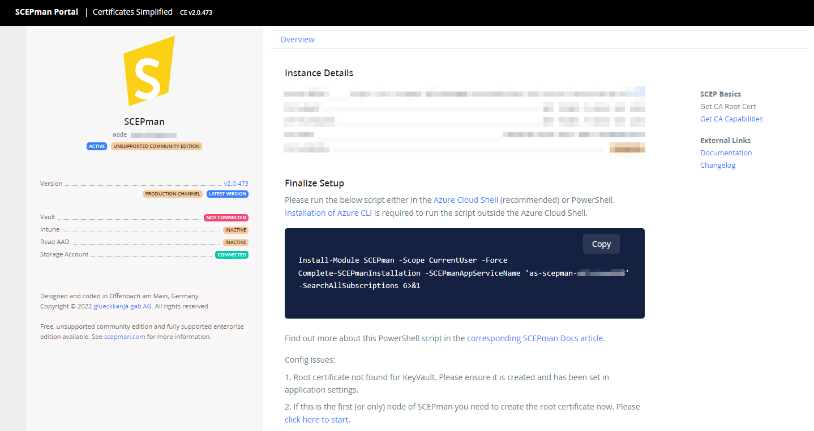

# V2.x: Managed Identities


This feature requires version **2.0** or above.


SCEPman needs to interact with your Azure Active Directory and Intune endpoints to provide the certificate and OCSP validation of users and devices. After deploying SCEPman from Marketplace or via GitHub deployment, SCEPman does not yet have the required permissions to access these services. The PowerShell Module described in this article adds the necessary permissions to the SCEPman App Service's Managed Identity and completes the installation.

Additionally, the PowerShell Module adds the required background wiring for the SCEPman Certificate Master component introduced with SCEPman 2.0. In case you upgraded from SCEPman 1.x to SCEPman 2.x, the PowerShell Module even adds two new Azure Resources for the SCEPman Certificate Master component.

## Acquire and run the SCEPman Installation PowerShell Module

Whether you have just installed a fresh SCEPman 2.x installation or if you have just upgraded from SCEPman 1.x to SCEPman 2.x, and in some cases after deployment architecture changes, the installation steps are the same. You download and run the SCEPman PowerShell Module, which detects what needs to be done and completes the installation. You can can run the SCEPman Module as often as you want, it will only add what is yet missing.

### Prerequisites

* A Global Admin Account for the tenant to which you want to install SCEPman (or another AAD role like _Privileged Role Administrator_ and write permissions to the Azure Subscription). There is an option to use an account with only the _Application Administrator_ role, and execute the commands requiring Global Administrator permissions later manually.
* A workstation with [Azure CLI](https://docs.microsoft.com/en-us/cli/azure/install-azure-cli) (also known as _az_) installed. Azure CLI is pre-installed in the [Azure Cloud Shell](https://docs.microsoft.com/en-us/azure/cloud-shell/overview), the preferred way to run the module.

### Running the SCEPman Installation CMDlet

Once this prerequisites are met, you can install the SCEPman installation module from PowerShell Gallery and then run the CMDlet to complete the SCEPman and Certificate Master installation.

First you need to navigate to SCEPman App Service and click on the URL (see screenshot below), this will navigate you to SCEPman homepage.


The homepage of your SCEPman instance shows the specific PowerShell commands to run if you haven't already run it (see screenshot below). This includes a parameter to identify your SCEPman instance, so the code can run ideally without any user interaction.




After running the CMDlet, you may get "Service not available" or "502 Server Error" on SCEPman homepage, please wait 2-3 minutes and refresh the page again.


If you have disabled the SCEPman Homepage or need to execute the CMDlet again, you can paste this code in your PowerShell Shell:

```
Install-Module SCEPman -Scope CurrentUser -Force
Complete-SCEPmanInstallation 6>&1
```

You will be asked for all required information, including:

* Which Azure Subscription SCEPman runs in (if there is more than one you have access to)
* The name of the SCEPman App Service (not required if you used the code from the SCEPman Homepage)

For SCEPman upgrades, you need two extra confirmations:

* The name of the new SCEPman Certificate Master App Service (you can confirm the suggestion by hitting enter or typing a new name for the resource)
* The name of the new Storage Account resource (again, you can confirm the suggestion by hitting enter or typing a new name for the resource)

### Running the SCEPman Installation CMDlet without Global Admin Role

Use the _-SkipAppRoleAssignments_ flag of Complete-SCEPmanInstallation to run the CMDlet without Global Admin permissions. This will skip the assignment of the required App Roles to the SCEPman and Certificate MasterApp Services' Managed Identities. You can then assign the App Roles manually as a Global Administrator. The CMDlet will print the required commands to the console.

### Considerations when using Deployment Slots

The SCEPman module updates the configuration in all deployment slots unless you tell it to use just one specific deployment slot with the parameter `-DeploymentSlotName` (which cannot be the main one, because technically it is no deployment slot). The configuration update changes the SCEPman settings to use Managed Identity authentication instead of Enterprise App authentication. SCEPman 1.x does not support Managed Identity authentication and therefore the CMDlet renders deployment slots unusable that still run a 1.x version.

Thus, if you have multiple deployment slots and do not want to upgrade all of them at once, you should update the production slot last -- its upgrade also affects all other deployment slots. For other deployment slots, use the `-DeploymentSlotName` parameter to target only these individual deployment slots. This is what the PowerShell commands displayed on the deployment slot's SCEPman homepage displays, so you can just copy the commands.

If you accidentally updated a deployment slot to Managed Identity authentication that still runs SCEPman 1.x, please look at the [downgrade guide](../deployment-options/enterprise-deployment.md#downgrade-from-2.x-to-1.x) to make it work again.

Once all your deployment slots are running on 2.x, just execute the Complete-SCEPmanInstallation CMDlet once more and then all of them use Managed Identities.

## Configure SCEPman Certificate Master


SCEPman Enterprise Edition only


### Granting the Rights to Request Certificates via the Certificate Master Website

Create an AAD Group, possibly a Privileged Access Group, for the people that shall be able to create web server certificates via SCEPman Certificate Master.

In the Azure Portal, visit [Enterprise applications](https://portal.azure.com/#blade/Microsoft\_AAD\_IAM/StartboardApplicationsMenuBlade/AllApps/menuId/). Remove the filter for "Application type == **Enterprise Applications**", search for _SCEPman-CertMaster_, and select the displayed application. Navigate to _Users and groups_ and click _Add user/group_ on the top menu. Select the group you have previously created. Select the desired role(s) (more information on the available roles can be found under [Certificate Master RBAC](../../advanced-configuration/rbac.md)). After you hit _Assign_, direct members of the group can visit the Certificate Master website and perform tasks according to the permission of the assigned role(s). Note that using Certificate Master is an Enterprise feature. After assignment, the setting should look like this:


## Background Details of the SCEPman PowerShell Module

This section describes the inner workings of the PowerShell Module. This may help if you have a special configuration that requires altering the script, if you need to grant some special permission, if you are troubleshooting issues with a SCEPman installation, or if you want to understand the inner workings to write an installation script for your own project. Note that the PowerShell Module is Open Source Software. You can review the source code in its [GitHub Repository](https://github.com/scepman/scepman-psmodule). Pull Requests are welcome!

We recommend to execute the commandlet with `6>&1`, which redirects the information stream and prints it on the screen, which gives more information about the state of the program than if you leave out the redirection. If you add `-Verbose`, there will be even more information about what the script does.

### How the CMDlet Configures SCEPman

The PowerShell CMDlet searches for the SCEPman App Service. The App Service uses a system-assigned Managed Identity, which already has access rights to the SCEPman's Azure Key Vault in a regular installation. The CMDlet adds permissions to access Microsoft Graph to search for users and devices in AAD and Intune for incoming OCSP requests and to Intune itself to verify incoming SCEP requests.

### How the CMDlet Handles Updates from SCEPman 1.x

In addition to granting the rights to SCEPman, the Module adds two new Azure Resources when performing an upgrade:

* The SCEPman Certificate Master App Service
* The Storage Account shared by SCEPman and SCEPman Certificate Master for manually created certificates

Even for the Community Edition, which does not use the SCEPman Certificate Master component, the two new resources are added. This enables switching to the Enterprise Edition more easily if you want, and does not add any extra cost -- the Storage Account will be empty and Microsoft bills this by the amount of storage, and the Certificate Master App Service shares an App Service Plan with SCEPman, which also adds no extra cost.

SCEPman 1.x used an App Registration to authenticate against Microsoft Graph and Intune, while SCEPman 2.x can use its Managed Identity. The CMDlet switches to the Managed Identity by changing these settings:

* [AppConfig:AuthConfig:ApplicationId](../../advanced-configuration/application-settings/azure-ad.md#appconfigauthconfigapplicationid) is set to a newly created app registration without any permissions. It is used to authenticate _against_ SCEPman, not for SCEPman authenticating somewhere else. The old value is backed up as `Backup:AppConfig:AuthConfig:ApplicationId`.
* [AppConfig:AuthConfig:ApplicationKey](../../advanced-configuration/application-settings/azure-ad.md#appconfigauthconfigapplicationkey) is deleted, the old value is backed up as `Backup:AppConfig:AuthConfig:ApplicationKey`. It is not needed anymore, because SCEPman does not authenticate as the Application.
* [AppConfig:AuthConfig:ManagedIdentityEnabledOnUnixTime](../../advanced-configuration/application-settings/azure-ad.md#appconfigauthconfigmanagedidentityenabledonunixtime) contains the time when the CMDlet was run. SCEPman acquires a token using the Managed Identity only after a short delay after the CMDlet was run, because only then do the roles in the token reflect the correct permissions added by the CMDlet.

### How the CMDlet Configures SCEPman Certificate Master

The SCEPman App Service allows anonymous access to its homepage, as it only displays non-sensitive read-only information. In contrast, the SCEPman Certificate Master component allows users to issue certificates. Hence, it allows only authenticated access and only if you have the right permissions. This requires an Azure App Registration with Delegated Permissions to see who is logged in and with the right log-in URL configuration. The module registers this App Registration as `SCEPman-CertMaster` in your Azure tenant.

Additionally, the SCEPman Certificate Master App Service needs permission to submit Certificate Signing Requests (CSRs) to the core SCEPman App Service to issue certificates. The authentication mechanism behind this founds on another App Registration: `SCEPman-api`. SCEPman uses _SCEPman-api_ to manage CSR submission permissions. The script registers SCEPman-api and adds the submission permission to the SCEPman Certificate Master Managed Identity.


In case of upgrading SCEPman from 1.x to 2.x and after successfully running the PS script, you can remove the App Registration that was used in SCEPman 1.x

SCEPman V2.x uses two new App Registrations: "SCEPman-api" and "SCEPman-CertMaster"

