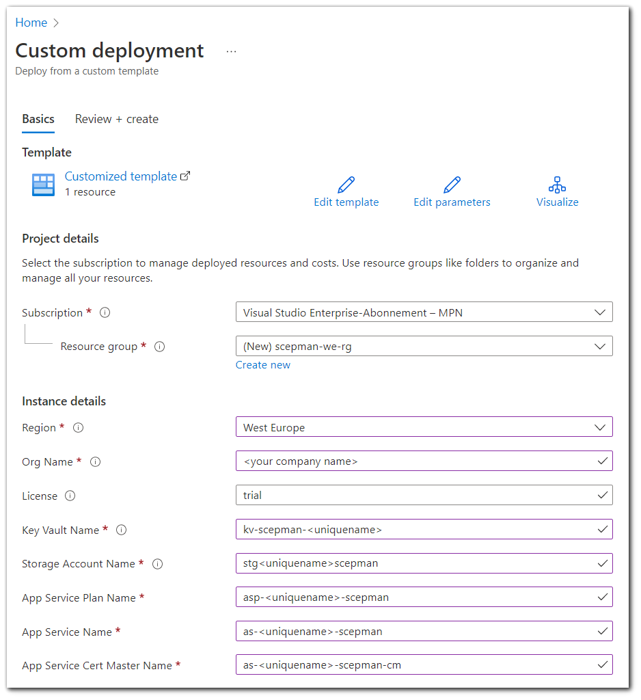

# SCEPman 2.x Deployment

The deployment of SCEPman 2.x is different from a SCEPman 1.x deployment. If you want to install a new SCEPman 2.x instance or upgrade your existing 1.x instance keep reading. If you want to install a new SCEPman 1.x instance, please follow the original guide [here](trial-guide.md).

## New SCEPman 2.0 Instance

**Deploy Azure Resources**

Log in with an AAD administrator account and visit this site, click on the following beta channel deployment link:

* Production channel is still on SCEPman 1.x
* [Beta Channel](https://portal.azure.com/#create/Microsoft.Template/uri/https%3A%2F%2Fraw.githubusercontent.com%2Fscepman%2Finstall%2Fmaster%2Fazuredeploy-beta.json)&#x20;
* [Internal Channel](https://portal.azure.com/#create/Microsoft.Template/uri/https%3A%2F%2Fraw.githubusercontent.com%2Fscepman%2Finstall%2Fmaster%2Fazuredeploy-internal.json)

Fill out the values in the form, similar to the screenshot below

* **Subscription:** Select your subscription, where you have permissions to create app services, storage account, app service plan, and key vault
* **Resource group:** Select an existing resource group or create a new one. The SCEPman resources will be deployed to this resource group.
* **Region:** Select the region according to your location
* **License:** leave it "trial" to deploy a community edition, or paste your license key -if you already have one- for an enterprise edition.
* Define a unique name for the **Key Vault Name, App Service Name,** and **App Service Cert Master Name,** you need just to replace it with the placeholder \<uniquename>
* By **Storage Account Name** please notice that the name **must** be between 3 and 24 characters in length and may contain **numbers and lowercase letters only,** otherwise
* **Review + create**, then **Create**

After a successful deployment of SCEPman 2.x please follow the [Post-Installation Configuration](../scepman-configuration/post-installation-config.md) article.

## Upgrade from 1.x to 2.x

SCEPman 2.0 comprises two additional Azure resources, an Azure Storage account and an App Service called "Certificate Master". These are used to issue and manage the server certificates. But you can run SCEPman 2.0 also without them if you just go for the client certificates as before.

This means you can just [switch between channels in the main component as was possible before](../scepman-configuration/optional/application-artifacts.md)

### Add SCEPman Certificate Master

If you want to use the new SCEPman Certificate Master component to issue server certificates, you need to add the additional Azure resources and configure them. This will enable authentication as Managed Identity, one advantage of it is you do not require any application secrets anymore. Thus, you also don't need to worry about the expiration of application secrets! This is how you do it:

After upgrading the main component, you need to follow the guide of [Post-Installation Configuration](../scepman-configuration/post-installation-config.md). In contrast to a new installation, this will also create the two new Azure resources.

## Downgrade from 2.x to 1.x

When it comes to the main SCEPman component, you can just switch between versions using the [WEBSITE\_RUN\_FROM\_PACKAGE](../scepman-configuration/optional/application-artifacts.md#change-artifacts) setting.

However, if you also used the PowerShell script to upgrade the internal wiring, there is one caveat: 2.x supports a different way of authentication to Graph and Intune using Managed Identities, which is also the new default and which is enabled by the script. If you downgrade your main component, it won't be able to use the new way of authentication and is missing one setting for the old one, so it won't work anymore. Thus, after a downgrade, you must manually change the application setting [AppConfig:AuthConfig:ApplicationKey](../scepman-configuration/optional/application-settings/azure-ad.md#appconfig-authconfig-applicationkey). The script renames the setting to `Backup:AppConfig:AuthConfig:ApplicationKey`, so you need to find the backup setting and rename it back to `AppConfig:AuthConfig:ApplicationKey`. Then the 1.x will work again using authentication based on App Registrations.

##
